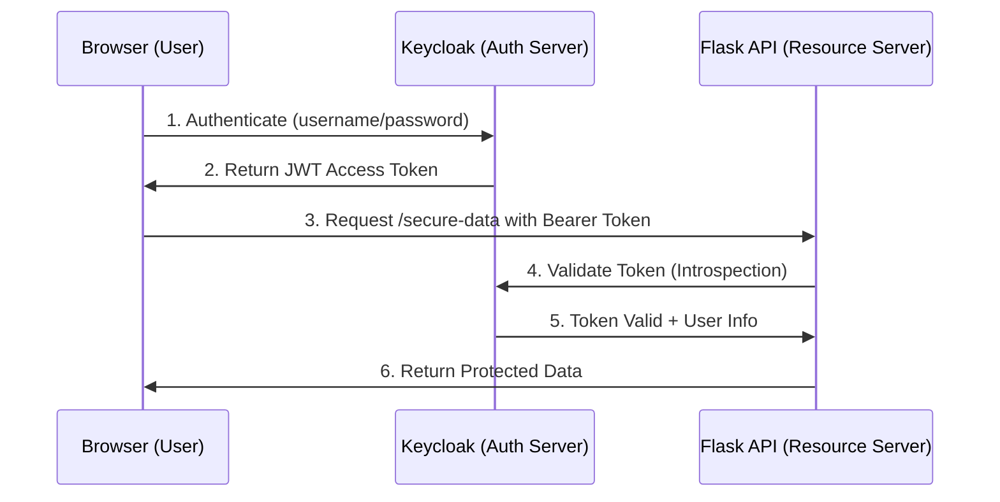

# Keycloak OAuth 2.0 Lab


## Overview

This hands-on lab teaches OAuth 2.0 authentication fundamentals using Keycloak as an Identity and
Access Management (IAM) solution. Students will deploy Keycloak on EC2 with SSL/TLS, configure
OAuth clients and realms, and build a Flask API that validates JWT tokens for secure access control.

## Learning Objectives

- Understand OAuth 2.0 and OpenID Connect authentication flows
- Deploy and configure Keycloak as a centralized identity provider
- Implement SSL/TLS security with self-signed certificates
- Create and manage realms, clients, and users in Keycloak
- Build a Flask API with OAuth 2.0 token validation
- Validate JWT tokens using token introspection
- Understand security patterns for distributed systems
- Compare different IAM solutions (Keycloak, AWS Cognito, Auth0, Firebase)

## Prerequisites

- AWS EC2 instance (t3.small or larger - **t2.micro is insufficient**)
- Open ports: 22 (SSH), 8443 (Keycloak HTTPS), 5000 (Flask API)
- Docker installed
- Python 3 with Flask
- Basic understanding of REST APIs and HTTP
- Familiarity with command line and SSH

## What is Keycloak?

**Keycloak** is an open-source Identity and Access Management (IAM) solution developed by Red Hat that provides:

- **Single Sign-On (SSO)** - Users authenticate once and access multiple applications
- **Identity Federation** - Integration with external providers (Google, Facebook, LDAP, Active Directory)
- **OAuth 2.0 & OpenID Connect** - Industry-standard authentication protocols
- **User Management** - Centralized user, role, and permission management
- **Multi-Factor Authentication (MFA)** - Enhanced security with 2FA/MFA
- **Token-based Authentication** - Stateless JWT tokens for scalable architectures

### Why Keycloak for Scalable Systems?

In modern distributed architectures, centralized authentication provides:

1. **Separation of Concerns** - Authentication logic separated from business logic
2. **Horizontal Scalability** - Stateless tokens enable independent service scaling
3. **Security Consistency** - Unified security policies across all services
4. **Multi-tenancy** - Realm isolation for different organizations/environments
5. **Compliance** - Centralized audit logs and access control

## Authentication vs Authorization

Understanding the distinction is fundamental:

### Authentication (Who are you?)

- Verifies user identity
- Methods: username/password, biometrics, certificates, tokens
- Result: Confirmed identity

### Authorization (What can you do?)

- Determines user permissions
- Based on: roles, permissions, policies, context
- Result: Access granted or denied

## OAuth 2.0 Fundamentals

**OAuth 2.0** is an authorization framework that enables applications to obtain limited access to
user resources without exposing credentials.

### Key Concepts

- **Resource Owner** - The user who owns the data
- **Client** - The application requesting access
- **Authorization Server** - Issues tokens (Keycloak in this lab)
- **Resource Server** - Hosts protected resources (Flask API in this lab)
- **Access Token** - Credential used to access protected resources

### JWT (JSON Web Tokens)

Keycloak uses JWT tokens for OAuth 2.0:

- **Self-contained** - Includes all necessary information
- **Stateless** - No server-side session storage required
- **Verifiable** - Cryptographically signed for integrity
- **Scalable** - Can be validated independently by any service

**JWT Structure:**

```text
header.payload.signature
```

- **Header** - Algorithm and token type
- **Payload** - Claims (user info, expiration, permissions)
- **Signature** - Cryptographic signature for verification

## Keycloak Realms

A **Realm** is a workspace that manages its own set of users, credentials, roles, and groups:

- **Complete Isolation** - Each realm operates independently
- **Independent Configuration** - Separate security policies per realm
- **Multi-tenancy** - One realm per client/organization in SaaS applications
- **Environment Separation** - Different realms for dev/staging/production

## IAM Solutions Comparison

| Feature | Keycloak | AWS Cognito | Auth0 | Firebase Auth |
| ------- | -------- | ----------- | ----- | ------------- |
| Type | Open Source | Managed Service | SaaS | SaaS |
| Cost | Free (self-hosted) | Pay-per-use | Freemium | Freemium |
| Scalability | Manual (clustering) | Automatic | Automatic | Automatic |
| Customization | Complete | Limited | Medium | Limited |
| Standards | OAuth2, OIDC, SAML | OAuth2, OIDC, SAML | OAuth2, OIDC | OAuth2, OIDC |
| Hosting | Self-hosted | AWS Cloud | Auth0 Cloud | Google Cloud |
| Data Control | Complete | Limited | Limited | Limited |

### When to Use Each

- **Keycloak** - Full control, compliance requirements, deep customization
- **AWS Cognito** - AWS-native applications, automatic scaling
- **Auth0** - Rapid development, multiple integrations
- **Firebase Auth** - Mobile/web apps in Google ecosystem

## Lab Architecture



**Flow:**

1. User authenticates with Keycloak using credentials
2. Keycloak issues JWT access token
3. User sends token to Flask API in Authorization header
4. Flask API validates token with Keycloak introspection endpoint
5. Keycloak confirms token validity and returns user information
6. API returns protected data if token is valid

## Lab Structure

This lab is divided into tasks that build upon each other:

1. **EC2 Setup** - Launch and configure EC2 instance
2. **Environment Setup** - Install dependencies and tools
3. **SSL Configuration** - Generate self-signed certificates
4. **Encryption Demo** - Compare HTTP vs HTTPS traffic
5. **Keycloak Deployment** - Run Keycloak with Docker
6. **Realm Configuration** - Create OAuth realm and client
7. **User Management** - Create and configure test users
8. **Client Secret** - Extract OAuth client credentials
9. **Flask API Development** - Build OAuth-protected API
10. **Token Testing** - Validate authentication flows
11. **Security Testing** - Test SSL and token validation

---

## Task 0: EC2 Instance Setup

### Step 0.1: Understanding Instance Requirements

Keycloak is a Java enterprise application that requires significant resources:

**Minimum Requirements:**

- **Instance Type:** t3.small (2 vCPU, 2 GB RAM)
- **Storage:** 20 GB
- **Why t2.micro is insufficient:** Keycloak's JVM requires ~1.5 GB RAM plus OS overhead

⚠️ **Warning:** Using t2.micro will cause container freezing and extremely slow performance.

### Step 0.2: Launch EC2 Instance

1. **Access AWS Academy Learner Lab**
   - Start Lab and wait for green indicator
   - Click "AWS" to access console

2. **Launch Instance**
   - Navigate to EC2 → Launch Instance
   - **Name:** `keycloak-lab`
   - **AMI:** Ubuntu Server 24.04 LTS
   - **Instance type:** t3.small (CRITICAL: NOT t2.micro)
   - **Key pair:** Create new or select existing
   - **Storage:** 20 GB gp3 (default)

3. **Configure Security Group**

   ```text
   Rule 1: SSH (22) - Source: My IP - Description: SSH access
   Rule 2: Custom TCP (8443) - Source: 0.0.0.0/0 - Description: Keycloak HTTPS
   Rule 3: Custom TCP (5000) - Source: 0.0.0.0/0 - Description: Flask API
   ```

4. **Launch Instance** and wait for "Running" state

### Step 0.3: Connect to Instance

```bash
# Set correct permissions on key file
chmod 400 your-key.pem

# Connect via SSH
ssh -i "your-key.pem" ubuntu@<PUBLIC-IP>
```

---

## Task 1: Environment Setup

### Step 1.1: Install Dependencies

```bash
# Update package list and install required tools
sudo apt update && sudo apt install -y docker.io jq python3-full openssl git

# Create Python virtual environment
python3 -m venv myenv
source myenv/bin/activate

# Install Python packages
pip install flask flask-jwt-extended requests
```

**Component Explanation:**

- **docker.io** - Container runtime for Keycloak
- **jq** - JSON processor for parsing API responses
- **python3-full** - Complete Python installation with pip and venv
- **openssl** - Cryptographic tools for SSL certificates
- **git** - Version control to clone the course repository
- **flask** - Lightweight web framework for APIs
- **flask-jwt-extended** - JWT token handling for Flask
- **requests** - HTTP library for API calls

### Step 1.2: Get EC2 Public DNS

```bash
# Get IMDSv2 token (more secure metadata access)
TOKEN=$(curl -sX PUT http://169.254.169.254/latest/api/token \
  -H "X-aws-ec2-metadata-token-ttl-seconds: 21600")

# Get public DNS hostname
KEYCLOAK_DNS=$(curl -sH "X-aws-ec2-metadata-token: $TOKEN" \
  http://169.254.169.254/latest/meta-data/public-hostname)

# Export for later use
export KEYCLOAK_DNS

# Display DNS
echo "Keycloak DNS: $KEYCLOAK_DNS"
```

**Expected output:** `ec2-X-X-X-X.compute-1.amazonaws.com`

---

## Task 2: SSL Certificate Configuration

### Step 2.1: Generate Self-Signed Certificates

```bash
# Create directory for certificates
mkdir -p ~/keycloak_certs && cd ~/keycloak_certs

# Generate private key and certificate
openssl req -newkey rsa:2048 -nodes -keyout tls.key -x509 -days 365 \
  -out tls.crt -subj "/CN=$KEYCLOAK_DNS"

# Verify files were created
ls -lh
```

**OpenSSL Parameters Explained:**

- `-newkey rsa:2048` - Generate 2048-bit RSA private key
- `-nodes` - Don't encrypt private key (no password required)
- `-keyout tls.key` - Output file for private key
- `-x509` - Create self-signed certificate
- `-days 365` - Certificate valid for 1 year
- `-out tls.crt` - Output file for certificate
- `-subj "/CN=$KEYCLOAK_DNS"` - Certificate Common Name (must match hostname)

**Files Created:**

- `tls.key` - Private key (keep secure)
- `tls.crt` - Public certificate (can be shared)

---

## Task 3: Demonstrate Encryption in Transit

### Understanding the Problem: Plaintext vs Encrypted Traffic

Before deploying Keycloak with HTTPS, let's demonstrate why encryption matters by comparing HTTP
(plaintext) and HTTPS (encrypted) traffic.

### Step 3.1: Capture Plaintext HTTP Traffic

```bash
# Create a test file with sensitive data
cd ~
echo "secret-password-123" > test.txt

# Start a simple HTTP server (NO encryption)
python3 -m http.server 8080 &
HTTP_PID=$!
sleep 2

# Capture network traffic on port 8080
sudo tcpdump -i lo -A port 8080 -w http_capture.pcap &
TCPDUMP_PID=$!
sleep 1

# Make a request to the HTTP server
curl http://localhost:8080/test.txt

# Stop capture
sleep 2
sudo kill $TCPDUMP_PID

# View the captured traffic (password is VISIBLE in plaintext)
sudo tcpdump -A -r http_capture.pcap | grep -A 5 "secret-password"

# Clean up
kill $HTTP_PID
rm test.txt
```

**What you'll see:**

```text
secret-password-123
```

☠️ **The password is completely visible!** Anyone monitoring the network can read it.

### Step 3.2: Capture Encrypted HTTPS Traffic

```bash
# Capture traffic on Keycloak's HTTPS port
sudo tcpdump -i lo -A port 8443 -w https_capture.pcap &
TCPDUMP_PID=$!
sleep 1

# Make a request to Keycloak over HTTPS (use localhost to capture on loopback)
curl -sk https://localhost:8443/

# Stop capture
sleep 2
sudo kill $TCPDUMP_PID

# View the captured traffic (data is ENCRYPTED - unreadable gibberish)
sudo tcpdump -A -r https_capture.pcap | head -30

# Clean up
rm http_capture.pcap https_capture.pcap
```

**What you'll see:**

```text
...E..@.@..............!.....P.......
.........x.2.K...........h..........
..........3.-./.,.0...........+./...
```

✅ **Encrypted gibberish!** The data is protected by TLS encryption.

### Key Takeaways

| Protocol | Port | Encryption | Security |
| -------- | ---- | ---------- | -------- |
| HTTP | 8080 | ❌ None | Passwords visible in plaintext |
| HTTPS | 8443 | ✅ TLS/SSL | Data encrypted, unreadable |

**Why this matters for OAuth:**

- JWT tokens contain sensitive user information
- Without HTTPS, tokens can be intercepted and stolen
- Attackers could replay stolen tokens to impersonate users
- HTTPS encrypts all traffic between client and server

**In production:**

- Always use HTTPS for authentication endpoints
- Never send tokens over HTTP
- Use certificates from trusted CAs (Let's Encrypt, DigiCert)

---

## Task 4: Deploy Keycloak with Docker

### Step 4.1: Run Keycloak Container

```bash
sudo docker run -d --name keycloak -p 8443:8443 \
  -v ~/keycloak_certs/tls.crt:/etc/x509/https/tls.crt \
  -v ~/keycloak_certs/tls.key:/etc/x509/https/tls.key \
  -e KEYCLOAK_ADMIN=admin \
  -e KEYCLOAK_ADMIN_PASSWORD=admin \
  quay.io/keycloak/keycloak start-dev \
  --https-certificate-file=/etc/x509/https/tls.crt \
  --https-certificate-key-file=/etc/x509/https/tls.key \
  --https-port=8443 \
  --http-host=0.0.0.0
```

**Docker Parameters Explained:**

- `-d` - Run in detached mode (background)
- `--name keycloak` - Container name for reference
- `-p 8443:8443` - Map port 8443 (host:container)
- `-v` - Mount certificate files into container
- `-e` - Set environment variables for admin credentials
- `start-dev` - Start in development mode
- `--https-port=8443` - Custom HTTPS port
- `--http-host=0.0.0.0` - Allow external connections

### Step 4.2: Verify Keycloak is Running

```bash
# Check container status
sudo docker ps

# View startup logs
sudo docker logs keycloak

# Verify port is listening
sudo netstat -tlnp | grep 8443
```

**Expected Output:**

- Container STATUS: "Up X minutes"
- Logs: "Keycloak X.X.X started in XXXXms"
- Port: `tcp6 0 0 :::8443 :::* LISTEN`

### Step 4.3: Access Keycloak Web Console

```bash
# Display access URL
echo "Access Keycloak at: https://$KEYCLOAK_DNS:8443"
```

**Browser Access:**

1. Navigate to `https://<KEYCLOAK_DNS>:8443`
2. Accept certificate warning (self-signed certificate)
3. Click "Administration Console"
4. Login: `admin` / `admin`

✅ **Success Indicators:**

- Keycloak welcome page loads
- SSL certificate is active (padlock icon with warning)
- Admin console is accessible
- Login successful

---

## Task 5: Configure Keycloak via API

### Step 5.1: Get Admin Access Token

```bash
# Configure master realm for 15-minute tokens
curl -sk -X PUT "https://$KEYCLOAK_DNS:8443/admin/realms/master" \
  -H "Authorization: Bearer $(curl -sk -X POST \
    "https://$KEYCLOAK_DNS:8443/realms/master/protocol/openid-connect/token" \
    -H "Content-Type: application/x-www-form-urlencoded" \
    -d "client_id=admin-cli" \
    -d "username=admin" \
    -d "password=admin" \
    -d "grant_type=password" | jq -r .access_token)" \
  -H "Content-Type: application/json" \
  -d '{"accessTokenLifespan": 900}'

# Get admin token (valid for 15 minutes)
ADMIN_TOKEN=$(curl -sk -X POST \
  "https://$KEYCLOAK_DNS:8443/realms/master/protocol/openid-connect/token" \
  -H "Content-Type: application/x-www-form-urlencoded" \
  -d "client_id=admin-cli" \
  -d "username=admin" \
  -d "password=admin" \
  -d "grant_type=password" | jq -r .access_token)

echo "Admin Token: $ADMIN_TOKEN"

# Verify token expiration
EXPIRY=$(echo $ADMIN_TOKEN | cut -d "." -f2 | base64 -d 2>/dev/null | jq -r .exp)
CURRENT_TIME=$(date +%s)
TIME_LEFT=$((EXPIRY - CURRENT_TIME))
echo "Token expires in: $TIME_LEFT seconds ($((TIME_LEFT / 60)) minutes)"
```

**OAuth 2.0 Flow Used:** Resource Owner Password Credentials Grant

- `grant_type=password` - Direct username/password exchange
- `client_id=admin-cli` - Special client for CLI administration
- Response includes `access_token` (JWT)

### Step 5.2: Create OAuth Realm

```bash
# Create new realm for OAuth demo
curl -sk -X POST "https://$KEYCLOAK_DNS:8443/admin/realms" \
  -H "Authorization: Bearer $ADMIN_TOKEN" \
  -H "Content-Type: application/json" \
  -d '{
    "realm": "OAuth-Demo",
    "enabled": true,
    "displayName": "OAuth Demo Realm",
    "accessTokenLifespan": 900
  }'

echo "Realm 'OAuth-Demo' created"

# Verify realm creation
curl -sk -H "Authorization: Bearer $ADMIN_TOKEN" \
  "https://$KEYCLOAK_DNS:8443/admin/realms/OAuth-Demo" | jq .realm
```

**Realm Configuration:**

- `realm` - Unique identifier (used in URLs)
- `enabled` - Activate realm immediately
- `displayName` - Human-readable name
- `accessTokenLifespan` - Token validity (900 seconds = 15 minutes)

### Step 5.3: Create OAuth Client

```bash
# Create OAuth client with proper configuration
curl -sk -X POST "https://$KEYCLOAK_DNS:8443/admin/realms/OAuth-Demo/clients" \
  -H "Authorization: Bearer $ADMIN_TOKEN" \
  -H "Content-Type: application/json" \
  -d '{
    "clientId": "OAuth-Client",
    "enabled": true,
    "clientAuthenticatorType": "client-secret",
    "directAccessGrantsEnabled": true,
    "standardFlowEnabled": true,
    "publicClient": false,
    "redirectUris": ["https://'$KEYCLOAK_DNS':5000/*"],
    "webOrigins": ["https://'$KEYCLOAK_DNS':5000"],
    "attributes": {
      "access.token.lifespan": "900"
    }
  }'

echo "OAuth Client created"

# Get client UUID and store it
CLIENT_UUID=$(curl -sk -H "Authorization: Bearer $ADMIN_TOKEN" \
  "https://$KEYCLOAK_DNS:8443/admin/realms/OAuth-Demo/clients" | \
  jq -r '.[] | select(.clientId=="OAuth-Client") | .id')

echo "Client UUID: $CLIENT_UUID"

# Export for later use
export CLIENT_UUID
```

**Client Configuration:**

- `clientId` - Public identifier for the client
- `clientAuthenticatorType: "client-secret"` - Uses shared secret
- `directAccessGrantsEnabled` - Allows password grant flow
- `standardFlowEnabled` - Allows authorization code flow
- `publicClient: false` - Confidential client (has secret)
- `redirectUris` - Allowed redirect URLs (security whitelist)
- `webOrigins` - CORS allowed origins

---

## Task 6: User Management

### Step 6.1: Create Test User via API

```bash
# Create user with profile information
curl -sk -X POST "https://$KEYCLOAK_DNS:8443/admin/realms/OAuth-Demo/users" \
  -H "Authorization: Bearer $ADMIN_TOKEN" \
  -H "Content-Type: application/json" \
  -d '{
    "username": "testuser",
    "enabled": true,
    "emailVerified": true,
    "email": "testuser@example.com",
    "firstName": "Test",
    "lastName": "User",
    "attributes": {
      "department": ["Engineering"],
      "role": ["Developer"]
    }
  }'

echo "User 'testuser' created"

# Get user ID
USER_ID=$(curl -sk -H "Authorization: Bearer $ADMIN_TOKEN" \
  "https://$KEYCLOAK_DNS:8443/admin/realms/OAuth-Demo/users?username=testuser" | \
  jq -r '.[0].id')

echo "User ID: $USER_ID"

# Set temporary password
curl -sk -X PUT \
  "https://$KEYCLOAK_DNS:8443/admin/realms/OAuth-Demo/users/$USER_ID/reset-password" \
  -H "Authorization: Bearer $ADMIN_TOKEN" \
  -H "Content-Type: application/json" \
  -d '{
    "type": "password",
    "value": "temppass123",
    "temporary": true
  }'

echo "Temporary password set: temppass123"
```

**User Configuration:**

- `username` - Login identifier (immutable)
- `enabled` - User can authenticate
- `emailVerified` - Skip email verification flow
- `attributes` - Custom metadata (included in JWT tokens)
- `temporary: true` - Forces password change on first login

### Step 6.2: Set Permanent Password via GUI

1. **Access Admin Console:** `https://<KEYCLOAK_DNS>:8443`
2. **Switch to OAuth-Demo realm** (dropdown top-left)
3. **Navigate to Users** → Search for "testuser"
4. **Go to Credentials tab**
5. **Click "Set Password"**
   - Password: `testuser234`
   - **Uncheck "Temporary"** (important!)
   - Click "Set Password"

### Step 6.3: Test User Login

1. **Open Account Console:** `https://<KEYCLOAK_DNS>:8443/realms/OAuth-Demo/account`
2. **Login:** `testuser` / `testuser234`
3. **Complete any required profile updates**
4. **Verify successful login**

### Step 6.4: Verify Active Session

From admin console:

1. **Go to Sessions** (left menu)
2. **Verify testuser session is active**
3. **Check IP address matches your location**

---

## Task 7: Get Client Secret

### Step 7.1: Extract Client Secret

```bash
# Get client secret
CLIENT_SECRET=$(curl -sk -H "Authorization: Bearer $ADMIN_TOKEN" \
  "https://$KEYCLOAK_DNS:8443/admin/realms/OAuth-Demo/clients" | \
  jq -r '.[] | select(.clientId=="OAuth-Client") | .secret')

echo "Client Secret: $CLIENT_SECRET"

# If secret is null, regenerate it
if [ -z "$CLIENT_SECRET" ] || [ "$CLIENT_SECRET" = "null" ]; then
  echo "Regenerating client secret..."

  # Get client UUID
  CLIENT_UUID=$(curl -sk -H "Authorization: Bearer $ADMIN_TOKEN" \
    "https://$KEYCLOAK_DNS:8443/admin/realms/OAuth-Demo/clients" | \
    jq -r '.[] | select(.clientId=="OAuth-Client") | .id')

  curl -sk -X POST \
    "https://$KEYCLOAK_DNS:8443/admin/realms/OAuth-Demo/clients/$CLIENT_UUID/client-secret" \
    -H "Authorization: Bearer $ADMIN_TOKEN"

  CLIENT_SECRET=$(curl -sk -H "Authorization: Bearer $ADMIN_TOKEN" \
    "https://$KEYCLOAK_DNS:8443/admin/realms/OAuth-Demo/clients/$CLIENT_UUID/client-secret" | \
    jq -r .value)

  echo "New Client Secret: $CLIENT_SECRET"
fi

# Export for use in Flask app
export CLIENT_SECRET
```

**Client Secret:**

- Shared credential between Keycloak and application
- Must be kept confidential (never expose in frontend code)
- Used to authenticate the client when requesting tokens
- Can be rotated without affecting users

---

## Task 8: Build OAuth-Protected Flask API

### Step 8.1: Get Flask Application

```bash
# Clone the course repository
cd ~
git clone https://github.com/gamaware/system-design-course.git

# Navigate to the lab directory
cd system-design-course/06-security-https-oauth2-keycloak/

# Verify app.py exists
ls -lh app.py
```

**What the Flask Application Does:**

The `app.py` file creates a REST API with three endpoints that demonstrate OAuth 2.0 authentication:

#### 1. Configuration (Lines 1-12)

- Reads `KEYCLOAK_DNS` and `CLIENT_SECRET` from environment variables
- Builds the Keycloak introspection URL dynamically
- Sets the client ID to "OAuth-Client"

#### 2. Token Verification Function (Lines 14-40)

```python
def verify_token(token):
```

- Takes a JWT token as input
- Sends it to Keycloak's introspection endpoint with client credentials
- Keycloak validates the token and returns user information
- Returns token info if valid, `None` if invalid/expired

**3. Three API Endpoints:**

**`/health` (Public)** - No authentication required

- Returns API status and timestamp
- Used to verify the API is running

**`/secure-data` (Protected)** - Requires valid JWT token

- Extracts token from `Authorization: Bearer <token>` header
- Calls `verify_token()` to validate with Keycloak
- If valid: Returns protected data + user info
- If invalid: Returns 401 (missing token) or 403 (invalid token)

**`/public-data` (Public)** - No authentication required

- Returns public data for comparison
- Shows the difference between protected and public endpoints

**Security Flow:**

1. Client sends request with `Authorization: Bearer <JWT>`
2. Flask extracts the JWT token
3. Flask asks Keycloak "Is this token valid?"
4. Keycloak responds with token status + user info
5. Flask grants or denies access based on Keycloak's response

This demonstrates **stateless authentication** - Flask doesn't store sessions, it validates every request with Keycloak.

### Step 8.2: Run Flask Application

```bash
# Ensure virtual environment is activated
source ~/myenv/bin/activate

# Export environment variables (required for app.py)
export KEYCLOAK_DNS
export CLIENT_SECRET

# Navigate to the lab directory
cd ~/system-design-course/06-security-https-oauth2-keycloak/

# Run Flask in background
python app.py &

# Save process ID
FLASK_PID=$!
echo "Flask running with PID: $FLASK_PID"

# Wait for Flask to start
sleep 3

# Test health endpoint
curl -s http://localhost:5000/health | jq .
```

**Expected Output:**

```json
{
  "status": "healthy",
  "timestamp": "2026-03-06T00:18:23.649000",
  "service": "OAuth Protected API"
}
```

---

## Task 9: Test OAuth Authentication

### Step 9.1: Get User Access Token

```bash
# Configure client for 15-minute tokens
curl -sk -X PUT "https://$KEYCLOAK_DNS:8443/admin/realms/OAuth-Demo/clients/$CLIENT_UUID" \
  -H "Authorization: Bearer $ADMIN_TOKEN" \
  -H "Content-Type: application/json" \
  -d '{
    "attributes": {
      "access.token.lifespan": "900"
    }
  }'

# Get access token for testuser
TOKEN=$(curl -sk -X POST \
  "https://$KEYCLOAK_DNS:8443/realms/OAuth-Demo/protocol/openid-connect/token" \
  -H "Content-Type: application/x-www-form-urlencoded" \
  -d "grant_type=password" \
  -d "client_id=OAuth-Client" \
  -d "client_secret=$CLIENT_SECRET" \
  -d "username=testuser" \
  -d "password=testuser234" | jq -r .access_token)

echo "Access Token: $TOKEN"

# Verify token expiration
EXPIRY=$(echo $TOKEN | cut -d "." -f2 | base64 -d 2>/dev/null | jq -r .exp)
CURRENT_TIME=$(date +%s)
TIME_LEFT=$((EXPIRY - CURRENT_TIME))
echo "Token expires in: $TIME_LEFT seconds ($((TIME_LEFT / 60)) minutes)"

# Export token
export TOKEN
```

**Token Request Parameters:**

- `grant_type=password` - Resource Owner Password Credentials flow
- `client_id` - OAuth client identifier
- `client_secret` - Client authentication credential
- `username` & `password` - User credentials

### Step 9.2: Test Access Without Token

```bash
echo "=== Test without authentication ==="
curl -X GET "http://$KEYCLOAK_DNS:5000/secure-data" -w "\nHTTP Status: %{http_code}\n"

echo -e "\n=== Test with invalid header ==="
curl -X GET "http://$KEYCLOAK_DNS:5000/secure-data" \
  -H "Authorization: InvalidFormat" -w "\nHTTP Status: %{http_code}\n"

echo -e "\n=== Test public endpoint ==="
curl -X GET "http://$KEYCLOAK_DNS:5000/public-data" | jq .
```

**Expected Results:**

- `/secure-data` without token → HTTP 401 (Unauthorized)
- `/secure-data` with invalid header → HTTP 401
- `/public-data` → HTTP 200 (Success)

### Step 9.3: Test Access With Valid Token

```bash
echo "=== Test with valid JWT token ==="
curl -X GET "http://$KEYCLOAK_DNS:5000/secure-data" \
  -H "Authorization: Bearer $TOKEN" | jq .

curl -X GET "http://$KEYCLOAK_DNS:5000/secure-data" \
  -H "Authorization: Bearer $TOKEN" -w "\nHTTP Status: %{http_code}\n" -s -o /dev/null
```

**Expected Output:**

```json
{
  "message": "Secure Data Access Granted",
  "user": "testuser",
  "client": "OAuth-Client",
  "expires_at": 1709689523,
  "data": {
    "sensitive_info": "This is protected data",
    "user_permissions": ["read", "write"],
    "timestamp": "2026-03-05T23:50:23.649000"
  }
}
```

✅ **Success Indicators:**

- HTTP Status: 200
- User information included in response
- Protected data returned
- Token expiration timestamp present

---

## Task 10: Security Testing

### Step 10.1: Verify HTTPS Configuration

```bash
echo "=== SSL Certificate Verification ==="
echo | openssl s_client -connect $KEYCLOAK_DNS:8443 -servername $KEYCLOAK_DNS 2>/dev/null | \
  openssl x509 -noout -text | grep -A 2 "Subject:"

echo -e "\n=== Test with strict SSL validation ==="
curl -X GET "https://$KEYCLOAK_DNS:8443/realms/OAuth-Demo/.well-known/openid-configuration" \
  --cacert ~/keycloak_certs/tls.crt -w "\nHTTP Status: %{http_code}\n" || \
  echo "SSL validation failed (expected with self-signed certificate)"
```

**SSL Verification:**

- Certificate subject should match `$KEYCLOAK_DNS`
- Strict validation fails with self-signed certificates (expected)
- In production, use certificates from trusted CA (Let's Encrypt, DigiCert, etc.)

### Step 10.2: Test Token Expiration

```bash
echo "=== Current token status ==="
echo "Token: ${TOKEN:0:50}..."
echo "Length: ${#TOKEN} characters"

# Wait for token to expire (or test with expired token)
echo -e "\n=== Test with expired token (wait 15 minutes or use old token) ==="
# After 15 minutes, the same curl command should return 403
```

### Step 10.3: Cleanup

```bash
# Stop Flask application
if [ ! -z "$FLASK_PID" ]; then
  kill $FLASK_PID 2>/dev/null
  echo "Flask application stopped"
fi

# Optional: Stop and remove Keycloak container
echo -e "\n=== Cleanup commands (optional) ==="
echo "Stop Keycloak: sudo docker stop keycloak"
echo "Remove container: sudo docker rm keycloak"
echo "Remove image: sudo docker rmi quay.io/keycloak/keycloak"
echo "Remove certificates: rm -rf ~/keycloak_certs"
```

---

## Lab Summary

### Concepts Learned

1. **Distributed Authentication Architecture**
   - Separation between authentication server (Keycloak) and applications
   - Stateless JWT tokens for scalable communication
   - OAuth 2.0 as industry-standard authorization framework

2. **Security in Scalable Systems**
   - SSL/TLS for encrypted communication
   - Token validation via introspection
   - Token expiration and lifecycle management
   - Separation of authentication and business logic

3. **Container Technology**
   - Docker deployment for reproducible environments
   - Environment variable configuration
   - Volume mounting for certificates

4. **REST APIs and Microservices**
   - Protected and public endpoints
   - HTTP authentication headers
   - Appropriate HTTP status codes (401, 403, 200)

### Real-World Applications

- **Multi-tenancy:** Realms for separating organizations
- **Identity Federation:** Integration with Google, LDAP, Active Directory
- **Horizontal Scalability:** Keycloak clustering for high availability
- **Microservices:** Centralized authentication for distributed architectures
- **DevOps:** API-driven configuration for infrastructure as code

### Security Best Practices

✅ **Do:**

- Use HTTPS for all authentication traffic
- Implement token expiration and refresh
- Validate tokens on every request
- Use confidential clients with secrets for backend applications
- Implement proper CORS and redirect URI whitelisting

❌ **Don't:**

- Expose client secrets in frontend code
- Use self-signed certificates in production
- Store tokens in localStorage (use httpOnly cookies)
- Skip token validation
- Use overly long token lifespans

---

## Troubleshooting

### Keycloak Container Won't Start

**Problem:** Container exits immediately or shows "OutOfMemoryError"

**Solution:**

- Verify instance type is t3.small or larger (not t2.micro)
- Check logs: `sudo docker logs keycloak`
- Ensure ports are not already in use: `sudo netstat -tlnp | grep 8443`

### Cannot Access Keycloak Web Console

**Problem:** Connection timeout or refused

**Solution:**

- Verify Security Group allows port 8443 from 0.0.0.0/0
- Check container is running: `sudo docker ps`
- Verify DNS is correct: `echo $KEYCLOAK_DNS`
- Try accessing via public IP instead of DNS

### Token Validation Fails

**Problem:** Flask API returns 403 even with valid token

**Solution:**

- Verify CLIENT_SECRET is correct: `echo $CLIENT_SECRET`
- Check token hasn't expired: Calculate time left
- Ensure Flask can reach Keycloak (network connectivity)
- Review Flask logs for detailed error messages

### Admin Token Expired

**Problem:** API calls return 401 Unauthorized

**Solution:**

- Tokens expire after 15 minutes
- Regenerate admin token: Re-run Step 4.1
- Export new token: `export ADMIN_TOKEN=<new_token>`

---

## Additional Resources

### Keycloak Documentation

- [Official Documentation](https://www.keycloak.org/documentation)
- [Admin REST API](https://www.keycloak.org/docs-api/latest/rest-api/)
- [Server Administration Guide](https://www.keycloak.org/docs/latest/server_admin/)

### OAuth 2.0 & OpenID Connect

- [OAuth 2.0 RFC 6749](https://datatracker.ietf.org/doc/html/rfc6749)
- [OpenID Connect Core](https://openid.net/specs/openid-connect-core-1_0.html)
- [JWT RFC 7519](https://datatracker.ietf.org/doc/html/rfc7519)

### AWS Security

- [AWS Well-Architected Framework - Security Pillar](https://docs.aws.amazon.com/wellarchitected/latest/security-pillar/)
- [EC2 Security Groups](https://docs.aws.amazon.com/AWSEC2/latest/UserGuide/ec2-security-groups.html)

### Flask & Python

- [Flask Documentation](https://flask.palletsprojects.com/)
- [Flask-JWT-Extended](https://flask-jwt-extended.readthedocs.io/)
- [Requests Library](https://requests.readthedocs.io/)

---

## Next Steps

After completing this lab, consider exploring:

1. **Advanced Keycloak Features**
   - Multi-factor authentication (MFA)
   - Social login integration (Google, GitHub)
   - Custom themes and branding
   - User federation with LDAP/Active Directory

2. **Production Deployment**
   - Keycloak clustering for high availability
   - PostgreSQL database backend (instead of H2)
   - Let's Encrypt SSL certificates
   - Load balancing with multiple Keycloak instances

3. **Advanced OAuth Flows**
   - Authorization Code flow with PKCE
   - Client Credentials flow for service-to-service
   - Token refresh mechanisms
   - Logout and session management

4. **Integration Patterns**
   - API Gateway integration
   - Service mesh authentication
   - Kubernetes deployment with Helm
   - CI/CD pipeline integration

---

## License

This lab is part of the Scalable Systems Design course at ITESO.

**Instructor:** Mtro. Jorge Alejandro García Martínez
**Email:** <alejandrogarcia@iteso.mx>
**Course:** Scalable Systems Design (ITE3901)

---

## Feedback

If you encounter issues or have suggestions for improving this lab, please contact the instructor
or submit feedback through Canvas.

**Canvas Course:** Check your semester's Canvas page for the course link.
