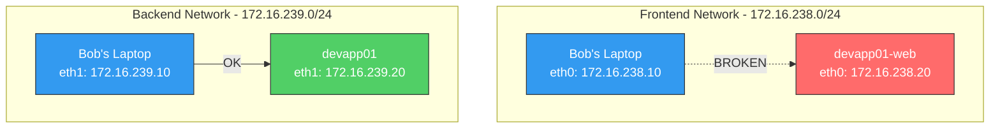

# Linux Networking Fundamentals Lab


## Overview

This hands-on lab teaches Linux networking fundamentals through a troubleshooting
scenario. Students will explore network interfaces, routing tables, and connectivity
tools while diagnosing and fixing a broken network configuration in a containerized
environment.

## Learning Objectives

- Inspect network interfaces and IP addresses using `ip a` and `ip link`
- Understand routing tables and default gateways using `ip r`
- Test network connectivity with `ping`, `telnet`, and `curl`
- Diagnose common network issues (down interfaces, missing routes)
- Fix network configurations using `ip link` and `ip route` commands
- Use SSH to access remote systems for troubleshooting

## Prerequisites

- Docker and Docker Compose installed
- Basic Linux command line knowledge
- No AWS account required — this lab runs entirely locally

## Architecture



**Scenario:** An Apache web server (`devapp01-web`) should be accessible from
Bob's laptop on port 80, but something is wrong with the network. Students must
find and fix the issue.

## Lab Structure

```text
07-networking/
├── README.md                  # This file
├── docker-compose.yml         # Lab environment definition
├── setup.sh                   # Start lab and introduce network issues
├── cleanup.sh                 # Tear down the environment
├── Dockerfile.laptop          # Bob's laptop image
├── Dockerfile.server          # Web server image
└── aws-vpc-architecture.png   # Architecture diagram for optional AWS section
```

## Quick Start

```bash
cd 07-networking
chmod +x setup.sh cleanup.sh
./setup.sh
```

Then connect to Bob's laptop:

```bash
docker exec -it bob-laptop bash
```

---

## Task 1: Explore Network Interfaces

Bob's laptop is connected to two networks. Your first job is to discover the
network configuration.

### Step 1.1: List all network interfaces

From inside Bob's laptop, run:

```bash
ip a
```

You will see several interfaces. Ignore `lo` (loopback, 127.0.0.1).

> **Question:** Which IP addresses are assigned to Bob's laptop on `eth0`
> and `eth1`?
>
> **Hint:** Look for `inet` lines under each interface. Both addresses
> start with `172.16.`.

### Step 1.2: Check interface status

```bash
ip link
```

> **Question:** What is the state of each interface? Look for `UP` or
> `DOWN` in the output.
>
> **Hint:** Both `eth0` and `eth1` on Bob's laptop should show `state UP`.

---

## Task 2: Understand Routing

The routing table determines where network traffic is sent.

### Step 2.1: View the routing table

```bash
ip r
```

You should see entries for each connected network and a `default` route.

> **Question:** What is the default gateway IP address?
>
> **Hint:** The `default via X.X.X.X` entry shows the gateway. In this
> lab, the gateway is the first usable IP in the subnet: `172.16.238.1`.

### Step 2.2: Understand the routing entries

Each line in the routing table tells the system how to reach a network:

```text
172.16.238.0/24 dev eth0    # Traffic to 172.16.238.x goes via eth0
172.16.239.0/24 dev eth1    # Traffic to 172.16.239.x goes via eth1
default via 172.16.238.1    # Everything else goes to the gateway
```

---

## Task 3: Test Connectivity to the Web Server

An Apache web server is running on `devapp01-web` (port 80). Let's test if
we can reach it.

### Step 3.1: Test HTTP connectivity

```bash
telnet devapp01-web 80
```

Press `Ctrl+]` then type `quit` to exit telnet, or wait for timeout.

> **Question:** Were you able to connect to port 80?
>
> **Hint:** The connection should fail or hang. Something is wrong with
> the network path to `devapp01-web`.

### Step 3.2: Test basic connectivity with ping

```bash
ping -c 3 devapp01-web
```

> **Question:** Does ping succeed? What does this tell you about the
> network path?
>
> **Hint:** Ping should fail. The hostname `devapp01-web` resolves to
> `172.16.238.20` (frontend network), but that interface may be down on
> the server.

---

## Task 4: Find an Alternative Path

The web server has two network interfaces. Try reaching it via its
backend IP address directly.

### Step 4.1: Ping the backend address

```bash
ping -c 3 172.16.239.20
```

> **Question:** Does this ping succeed? Why does this work when
> `devapp01-web` did not?
>
> **Hint:** `172.16.239.20` is the server's backend interface, which is
> UP. The frontend interface (`172.16.238.20`) is DOWN, which is why
> `devapp01-web` was unreachable.

---

## Task 5: Troubleshoot from the Server

Since we can reach the server via the backend network, let's connect and
investigate.

### Step 5.1: Connect to the web server

Option A — SSH from Bob's laptop (use the backend IP since the hostname
may resolve to the unreachable frontend address):

```bash
ssh bob@172.16.239.20
```

When prompted, enter the password printed by `setup.sh`

Option B — Direct container access (from your host terminal):

```bash
docker exec -it devapp01 bash
```

### Step 5.2: Inspect interfaces on the server

```bash
ip link
```

> **Question:** What is the state of `eth0` on the server?
>
> **Hint:** The interface carrying `172.16.238.20` should show `state DOWN`.
> This is why `devapp01-web` is unreachable. Note: the interface name may
> be `eth0` or `eth1` depending on your environment — identify it by IP.

### Step 5.3: Check the routing table

```bash
ip r
```

> **Question:** Is there a default route configured?
>
> **Hint:** There should be no `default` entry. The default route is
> missing, which prevents the server from reaching off-subnet destinations.
> Traffic between Bob's laptop and `devapp01-web` on the same
> `172.16.238.0/24` subnet uses the connected route, but external
> connectivity requires a default route.

---

## Task 6: Fix the Network

Fix the downed interface first to restore connectivity from Bob's laptop.
Then add a default route to restore the server's outbound connectivity.

### Step 6.1: Bring up the frontend interface

First, identify which interface has `172.16.238.20` (it may not be `eth0`):

```bash
ip -o -4 addr show | grep 172.16.238.20
```

The second column shows the interface name. Bring it up (use `sudo` if
connected via SSH). For example, if the interface is `eth0`:

```bash
sudo ip link set dev eth0 up
```

Verify the interface is now UP:

```bash
ip link show eth0
```

### Step 6.2: Add the missing default route

```bash
sudo ip route add default via 172.16.238.1
```

Verify the route was added:

```bash
ip r
```

### Step 6.3: Verify connectivity from Bob's laptop

Go back to Bob's laptop (`exit` from SSH, or open a new terminal):

```bash
docker exec -it bob-laptop bash
```

Test connectivity:

```bash
# Ping should now succeed
ping -c 3 devapp01-web

# Telnet to port 80 should connect
telnet devapp01-web 80

# Curl should return the web page
curl http://devapp01-web
```

Expected output from curl:

```html
<html><body><h1>Welcome to devapp01 Web Server</h1></body></html>
```

---

## Optional: AWS VPC Networking

This section maps the Linux networking concepts you just practiced to their
AWS equivalents. You will create a VPC, launch an EC2 instance, and observe
the same fundamentals (interfaces, IPs, routing) in a cloud environment.

**Requirements:** AWS Academy Learner Lab or AWS account with EC2 access.


### Task 7: Create a VPC

1. Open the **VPC Console** in AWS
2. Click **Create VPC** and select **VPC and more**
3. Configure:
   - **Name:** `networking-lab`
   - **IPv4 CIDR:** `172.16.0.0/16`
   - **Number of Availability Zones:** 1
   - **Number of public subnets:** 1
   - **Number of private subnets:** 1
   - **NAT gateways:** None
   - **VPC endpoints:** None
4. Click **Create VPC**

The wizard automatically creates the VPC, subnets, route tables, and an
internet gateway — no manual route table configuration needed.

> **Question:** How does this VPC map to the Docker lab? What is the AWS
> equivalent of the two Docker networks you worked with?
>
> **Hint:** The public and private subnets are analogous to the frontend
> and backend networks. The instance's default gateway is the VPC router
> (first IP in the subnet), while the Internet Gateway is a route-table
> target that enables internet access.

### Task 8: Launch an EC2 Instance

1. Open the **EC2 Console** and click **Launch Instance**
2. Configure:
   - **Name:** `networking-lab-instance`
   - **AMI:** Amazon Linux 2023
   - **Instance type:** t2.micro
   - **Key pair:** Create or select an existing key pair
   - **Network settings:** Select `networking-lab` VPC, public subnet
   - **Auto-assign Public IP:** Enable
   - **Security group:** Allow SSH (port 22) from your IP
3. Launch the instance and connect via SSH

### Task 9: Explore Networking on EC2

Once connected to your instance, run the same commands from Part 1:

```bash
# View network interfaces — compare to Docker lab
ip a

# View routing table — notice the default gateway
ip r

# Test external connectivity
ping -c 3 google.com
```

> **Question:** How many interfaces does the EC2 instance have? What is
> the default gateway, and who configured it?
>
> **Hint:** EC2 instances typically have one interface (`eth0`) with a
> private IP from the subnet CIDR. The default gateway is automatically
> set by AWS (first IP in the subnet, e.g., `172.16.0.1`). Unlike the
> Docker lab, you did not need to configure this manually.

### Task 10: Compare Linux vs AWS Networking

| Linux Concept | AWS Equivalent |
| --- | --- |
| Network interface (`eth0`) | Elastic Network Interface (ENI) |
| IP address (`ip a`) | Private/Public IP assigned to ENI |
| Routing table (`ip r`) | VPC Route Table |
| Default gateway | VPC router (first IP in the subnet) |
| Internet egress path | Internet Gateway / NAT Gateway via route table |
| Multiple interfaces | Multiple ENIs attached to an instance |
| `ip link set up/down` | ENI attachment state at the instance layer |
| Firewall rules | Security Groups / Network ACLs |

> **Key insight:** AWS automates what you did manually in the Docker lab.
> The VPC wizard created route tables, attached an internet gateway, and
> assigned IPs — all the steps that required manual `ip` commands in Linux.

### AWS Cleanup

Delete resources in this order to avoid dependency errors:

1. **Terminate** the EC2 instance
2. Wait for the instance to fully terminate
3. Go to **VPC Console** and **Delete** the `networking-lab` VPC
   (this removes subnets, route tables, and the internet gateway)

---

## Local Cleanup

```bash
./cleanup.sh
```

Or manually:

```bash
docker compose down -v --rmi local
```

## Troubleshooting

| Symptom | Cause | Fix |
| --- | --- | --- |
| `setup.sh` fails with permission denied | Script not executable | `chmod +x setup.sh` |
| `docker compose` not found | Docker Compose V2 not installed | Install Docker Desktop or `docker-compose-plugin` |
| `ip link set` permission denied | Missing NET_ADMIN capability | Ensure `cap_add: NET_ADMIN` is in docker-compose.yml |
| eth0 shows a different IP | Interface ordering varies | Run `ip a` and match IPs to identify the correct interface |
| SSH connection refused | SSHD not running on server | Use `docker exec -it devapp01 bash` instead |

## Key Concepts

| Concept | Description |
| --- | --- |
| **Network Interface** | A connection point between a device and a network (e.g., `eth0`, `eth1`) |
| **IP Address** | Unique identifier assigned to each interface on a network |
| **Routing Table** | Rules that determine where to send network traffic |
| **Default Gateway** | The router used to reach networks not in the local routing table |
| **Subnet** | A logical division of an IP network (e.g., `172.16.238.0/24`) |
| **DNS Resolution** | Translating hostnames (`devapp01-web`) to IP addresses (`172.16.238.20`) |

## Conclusions

After completing this lab, you should take away these lessons:

1. **Every network connection has layers.** A working connection requires the
   interface to be UP, an IP address assigned, a route to the destination,
   and the target service listening on the expected port.

2. **Multiple interfaces provide redundancy.** The web server had two network
   paths. When one failed, the other allowed access for troubleshooting — a
   pattern used extensively in production systems.

3. **Routing is not automatic.** A system with a network interface does not
   automatically know how to reach every destination. Default routes must be
   configured to enable connectivity beyond directly connected networks.

4. **Troubleshooting is systematic.** The approach used in this lab — test
   connectivity, isolate the failure point, access via alternative path,
   inspect the server, fix and verify — applies to real-world network
   debugging at any scale.

5. **These fundamentals map directly to cloud networking.** As the optional
   AWS section demonstrates, VPCs, subnets, route tables, and security
   groups are abstractions of the same concepts you practiced locally.
   AWS automates what you did manually — but understanding the underlying
   mechanics makes cloud networking far easier to debug.

## Next Steps

- [Module 08 — Distributed File Systems](../08-distributed-file-systems/) —
  explore how networked storage works across multiple nodes
