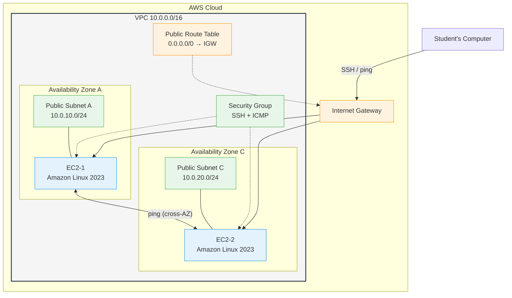
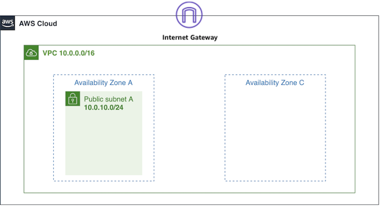
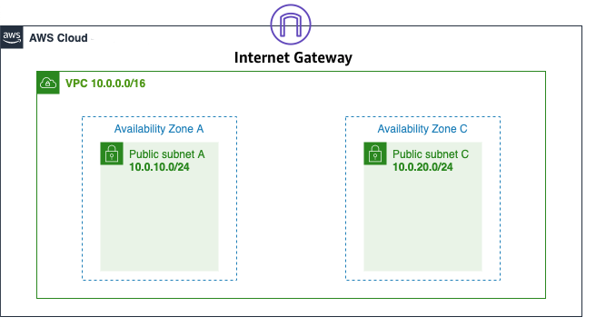

# Cloud Networking: AWS VPC with Infrastructure as Code


## Overview

This hands-on lab teaches AWS VPC networking through Infrastructure as Code.
Students deploy a VPC with two public subnets across two Availability Zones
using CloudFormation, create security groups via the AWS CLI, and launch EC2
instances with Terraform. This builds directly on the Linux networking
fundamentals from [Lab 07](../07-networking/) and introduces three
complementary approaches to managing cloud infrastructure.

## Choose Your Operating System

Select the lab instructions for your operating system:

| Operating System | Lab Instructions | Terminal |
| --- | --- | --- |
| macOS / Linux | [LAB-MACOS.md](LAB-MACOS.md) | Terminal (bash/zsh) |
| Windows | [LAB-WINDOWS.md](LAB-WINDOWS.md) | PowerShell |

Both versions cover the same 8 tasks with identical learning outcomes. The
only differences are installation steps and terminal commands. All commands
executed inside SSH sessions on EC2 instances are the same regardless of your
local operating system.

## Learning Objectives

- Deploy a VPC with public subnets, an Internet Gateway, and route tables
  using CloudFormation
- Create EC2 key pairs and security groups using the AWS CLI
- Launch EC2 instances across multiple Availability Zones using Terraform
- Test cross-AZ connectivity with `ping`, `curl`, and SSH
- Compare declarative IaC (CloudFormation, Terraform) with imperative CLI
  commands
- Map AWS VPC concepts to the Linux networking fundamentals from Lab 07

## Architecture

The following diagram shows the target architecture you will build in this
lab. CloudFormation creates the network foundation (orange), the AWS CLI
creates security resources (green), and Terraform creates the compute
instances (blue).



**Tool responsibilities:**

| Color | Tool | Resources |
| --- | --- | --- |
| Orange | CloudFormation | VPC, subnets, Internet Gateway, route tables |
| Green | AWS CLI | Key pair, security group |
| Blue | Terraform | EC2-1, EC2-2 |

After the VPC is created (Task 2), the network foundation looks like this:



After both subnets are provisioned and route tables are associated:



### Bridge from Lab 07

The following table maps the Linux networking concepts you practiced in
Lab 07 to their AWS VPC equivalents in this lab:

| Lab 07 (Docker/Linux) | Lab 08 (AWS VPC) |
| --- | --- |
| Docker bridge network `172.16.238.0/24` | Public Subnet A `10.0.10.0/24` |
| Docker bridge network `172.16.239.0/24` | Public Subnet C `10.0.20.0/24` |
| `ip link set eth0 up` | ENI state (managed automatically by AWS) |
| `ip route add default via 172.16.238.1` | Route table entry: `0.0.0.0/0` -> IGW |
| Manual `ping`, `curl`, `ssh` | Same commands -- the fundamentals transfer directly |
| `docker-compose.yml` | CloudFormation YAML + Terraform HCL |

## Lab Structure

```text
08-cloud-networking-vpc/
├── README.md                          # This file (lab overview)
├── LAB-MACOS.md                       # Lab instructions (macOS/Linux)
├── LAB-WINDOWS.md                     # Lab instructions (Windows/PowerShell)
├── setup.sh                           # Deploy CF stack + init TF (bash)
├── setup.ps1                          # Deploy CF stack + init TF (PowerShell)
├── cleanup.sh                         # Destroy all resources (bash)
├── cleanup.ps1                        # Destroy all resources (PowerShell)
├── cloudformation/
│   └── vpc-network.yaml               # VPC + subnets + IGW + route tables
├── terraform/
│   ├── main.tf                        # EC2 instances using CF outputs
│   ├── variables.tf                   # Input variables
│   ├── outputs.tf                     # Instance IPs and SSH commands
│   ├── user-data.sh                   # EC2 bootstrap script (httpd install)
│   └── terraform.tfvars.example       # Example variable values
├── scripts/
│   ├── validate-connectivity.sh       # Connectivity tests (bash)
│   └── validate-connectivity.ps1      # Connectivity tests (PowerShell)
└── images/                            # Architecture and reference screenshots
```

## Tasks Overview

The lab consists of 8 tasks that build on each other:

| Task | Tool | What You Do |
| --- | --- | --- |
| 1. Verify Prerequisites | -- | Install AWS CLI, Terraform, verify credentials |
| 2. Deploy VPC Network | CloudFormation | Deploy VPC, subnets, IGW, route tables |
| 3. Create Key Pair | AWS CLI | Create SSH key pair for EC2 access |
| 4. Create Security Group | AWS CLI | Create firewall rules (SSH, ICMP, HTTP) |
| 5. Deploy EC2 Instances | Terraform | Launch 2 instances across 2 Availability Zones |
| 6. Test Connectivity | SSH / ping / curl | Verify cross-AZ communication and internet access |
| 7. IaC Comparison | -- | Reflect on CloudFormation vs CLI vs Terraform |
| 8. Cleanup | All tools | Delete all AWS resources |

## Key Concepts

| Concept | Description |
| --- | --- |
| **VPC** | A logically isolated virtual network in AWS where you launch resources |
| **Subnet** | A range of IP addresses within a VPC, tied to a specific Availability Zone |
| **Internet Gateway** | A VPC component that enables communication between the VPC and the internet |
| **Route Table** | A set of rules that determine where network traffic is directed |
| **Security Group** | A stateful virtual firewall that controls inbound and outbound traffic |
| **Availability Zone** | A physically isolated data center within an AWS Region |
| **CloudFormation** | AWS-native IaC service that provisions resources from YAML/JSON templates |
| **Terraform** | Open-source IaC tool that manages infrastructure across cloud providers |
| **CIDR Block** | A notation for IP address ranges (e.g., `10.0.0.0/16` = 65,536 addresses) |

### Understanding CIDR Address Ranges

The VPC uses `10.0.0.0/16`, which provides 65,536 IP addresses (2^16). Each
subnet uses a `/24` block, providing 256 addresses (2^8). AWS reserves 5
addresses in each subnet:

| Address | Purpose |
| --- | --- |
| `10.0.10.0` | Network address |
| `10.0.10.1` | Reserved for VPC router (this is the default gateway) |
| `10.0.10.2` | Reserved for DNS |
| `10.0.10.3` | Reserved for future use |
| `10.0.10.255` | Network broadcast address |

This leaves 251 usable addresses per subnet.

## How This Relates to Scalable Systems Design

The networking foundation you build in this lab underpins every scalable
architecture you will encounter in this course and in your final project.

**Multi-AZ deployment is the foundation of high availability.** By placing
subnets in two Availability Zones, you ensure that a failure in one physical
data center does not take down your entire application. Every production
system at scale uses multi-AZ (or multi-region) deployment. When you add
load balancers in later labs, they will distribute traffic across these AZs
automatically.

**VPCs provide network isolation for microservices.** In a microservices
architecture, different services often run in separate subnets or even
separate VPCs. This isolation prevents a compromised service from accessing
other parts of your system. The VPC you build is a single-tier network;
production architectures typically have public subnets (for load balancers),
private subnets (for application servers), and isolated subnets (for
databases).

**Security groups implement the principle of least privilege at the network
level.** You restrict SSH to your IP address and limit ICMP and HTTP to
specific protocols and ports. At scale, security groups become the primary
mechanism for controlling east-west traffic (service-to-service) and
north-south traffic (client-to-service). Each microservice gets its own
security group with only the ports it needs.

**Infrastructure as Code enables reproducible, version-controlled
infrastructure.** When a team grows from 2 to 20 engineers, clicking through
the AWS Console stops working. IaC templates let you review infrastructure
changes in pull requests, roll back mistakes, and spin up identical
environments for development, staging, and production. This is essential
when scaling teams.

**Route tables control traffic flow, which becomes critical when designing
for fault tolerance.** In this lab, a single route table sends all internet
traffic through one Internet Gateway. In production, you might have separate
route tables for public and private subnets, VPN connections, VPC peering
routes, or Transit Gateway attachments. Understanding route tables is
essential for designing network topologies that survive component failures.

**Connection to earlier labs:** The load balancing concepts from Lab 03
require multiple backend servers in different AZs -- exactly the multi-AZ
setup you build here. The security concepts from Lab 06 (HTTPS, OAuth2)
depend on network-level isolation to ensure that authentication traffic
cannot be intercepted. In your final project, you will use these VPC
patterns as the network foundation for your scalable architecture.

## Conclusions

After completing this lab, you should take away these lessons:

1. **Infrastructure as Code makes networking reproducible.** The
   CloudFormation template defines the exact same VPC every time it runs.
   No clicking through consoles, no missed steps, no configuration drift.
   The template is version controlled alongside your application code.

2. **Different tools excel at different things.** CloudFormation is tightly
   integrated with AWS and handles resource dependencies automatically.
   Terraform provides a preview (`plan`) before making changes and works
   across cloud providers. The CLI is fast for one-off operations and
   diagnostics. Real-world teams often use all three.

3. **The networking fundamentals from Lab 07 apply directly.** The `ip a`,
   `ip r`, and `ping` commands you learned on Docker containers work
   identically on EC2 instances. AWS automates what you did manually
   (interface configuration, default routes via DHCP), but understanding
   the mechanics makes cloud networking far easier to debug.

4. **Security groups are your first line of defense.** Restricting SSH to
   your IP instead of the world is a simple step that prevents a huge
   class of attacks. Security groups are stateful -- you define inbound
   rules and return traffic is automatically allowed.

5. **Cross-AZ deployment provides high availability.** Placing instances
   in different Availability Zones means your application survives a
   single data center failure. The VPC route table and Internet Gateway
   span all AZs -- they are regional resources, not zonal.

## Next Steps

- [Module 09 -- Distributed File Systems](../09-distributed-file-systems/) --
  explore how networked storage works across multiple nodes
- [AWS VPC Documentation](https://docs.aws.amazon.com/vpc/latest/userguide/) --
  deep dive into VPC features (VPC peering, Transit Gateway, PrivateLink)
- [CloudFormation User Guide](https://docs.aws.amazon.com/AWSCloudFormation/latest/UserGuide/) --
  learn advanced template features (nested stacks, conditions, mappings)
- [Terraform AWS Provider](https://registry.terraform.io/providers/hashicorp/aws/latest/docs) --
  explore all AWS resources Terraform can manage
