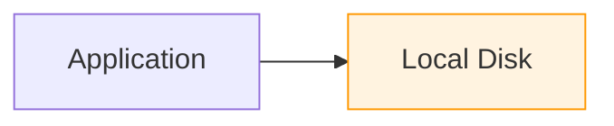
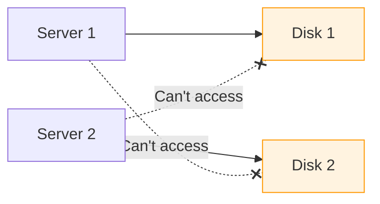
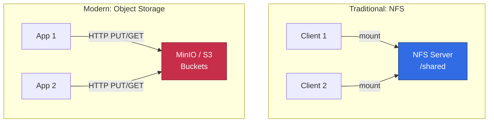
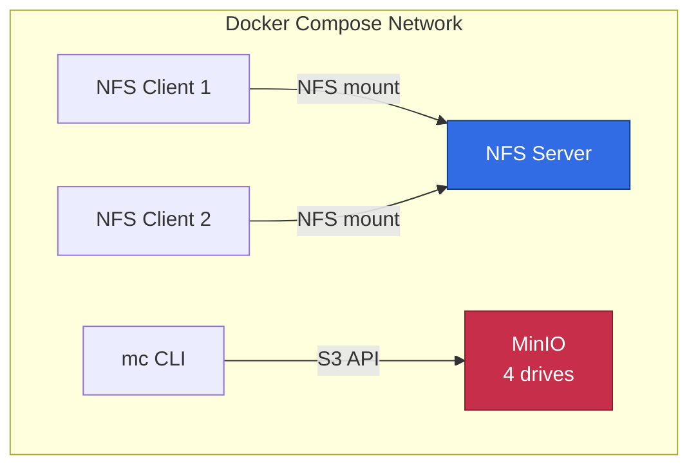
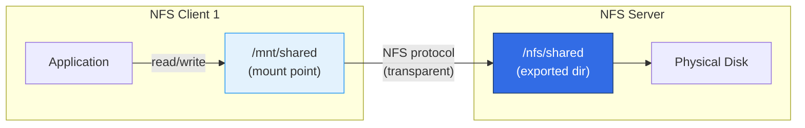
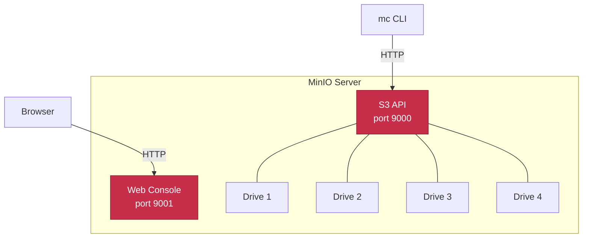
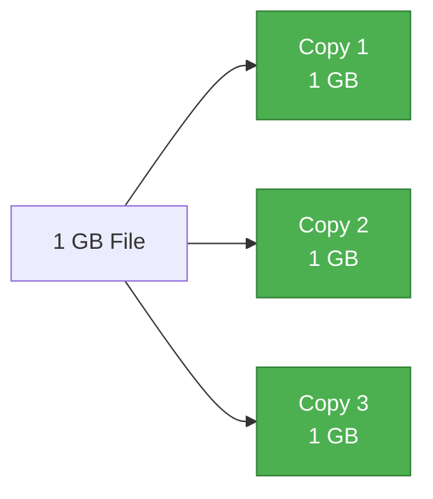
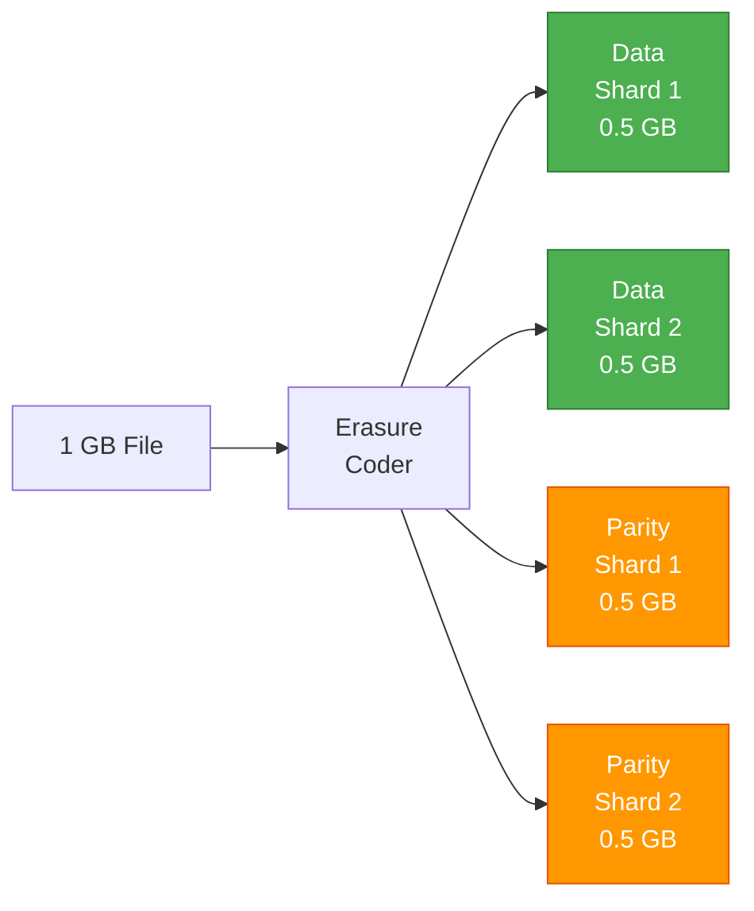
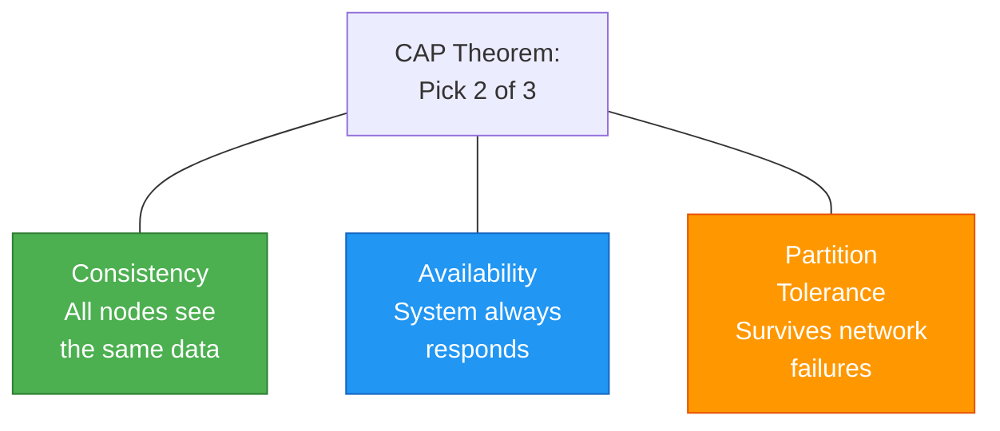
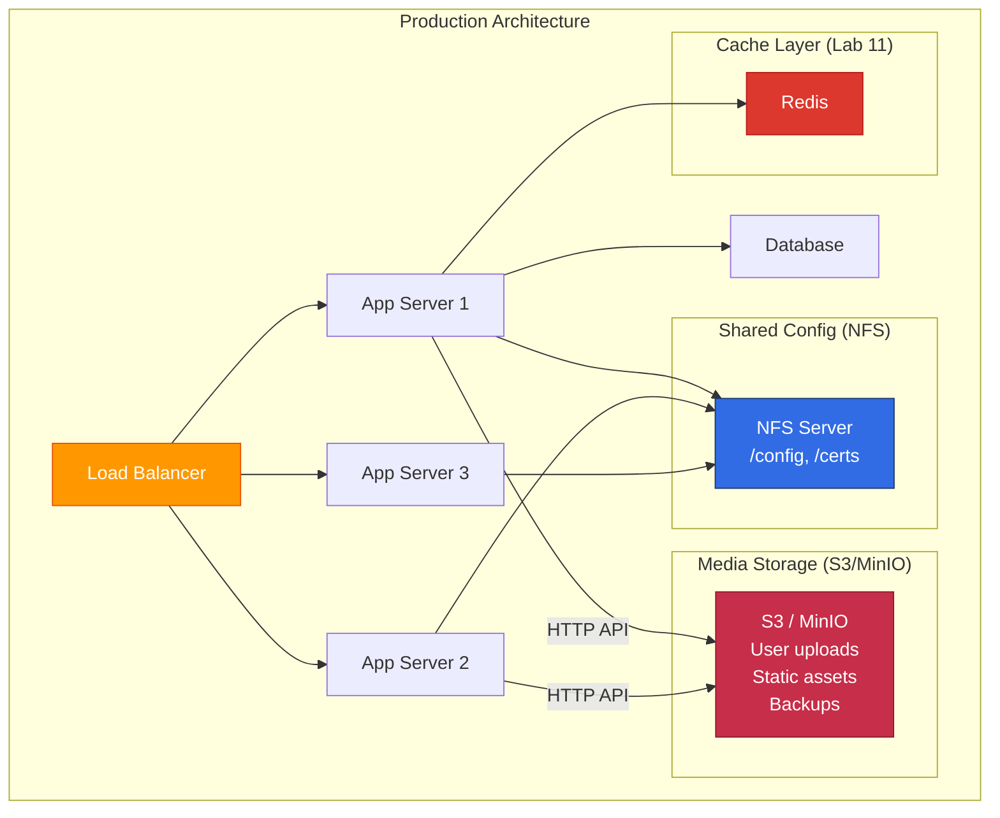

# Instructor Guide: Distributed File Systems

This guide walks you through delivering Lab 09 to students. It
explains the **why** behind each task, provides talking points for
the whiteboard, and builds the architecture diagram progressively
so students see how each piece connects.

## Lesson Flow (estimated 2 hours)

| Time | Section | What Students Do |
| --- | --- | --- |
| 0:00 | Introduction | Listen, follow whiteboard |
| 0:15 | Tasks 1-2 | Start environment, inspect NFS config |
| 0:30 | Task 3 | NFS client operations, locking |
| 0:50 | Tasks 4-5 | MinIO buckets, object operations |
| 1:10 | Task 6 | Erasure coding demo |
| 1:25 | Task 7 | MinIO vs AWS S3 comparison |
| 1:40 | Task 8 | Benchmarks, CAP discussion |
| 1:55 | Wrap-up | Cleanup, conclusions |

---

## Introduction (15 minutes)

### The Problem

Start with a question to the class:

> "You have an application running on 10 servers. Where do those
> servers store their data? What happens when server 3 needs a file
> that server 7 created?"

This is the distributed storage problem. Every scalable system must
decide how data is stored, shared, and protected across multiple
machines.

### Whiteboard: Start with a single server

Draw a single application server with local disk:



**Explain:** This works for a single server. The application reads
and writes files directly. But what happens when we add more
servers?

### Whiteboard: The scaling problem

Add a second server -- both need the same data:



**Explain:** Server 1 cannot read files from Server 2's disk. We
need a way to share storage across the network. Two approaches
emerged historically:

1. **File storage (NFS)** -- make remote disks look local
2. **Object storage (S3/MinIO)** -- access data via HTTP API

### Whiteboard: Two approaches side by side



**Key differences to emphasize:**

| Aspect | NFS | Object Storage |
| --- | --- | --- |
| How apps see it | A directory on disk | An HTTP endpoint |
| Operations | read, write, seek, lock | PUT, GET, DELETE |
| Structure | Hierarchical (folders) | Flat (buckets + keys) |
| Modify a file | Edit in place | Upload a new version |

Tell students: "In this lab, you'll build both and compare them."

---

## Task 1: Start the Environment

### Talking points before students start

**What Docker is doing:** We're simulating a mini data center with
5 containers:



**Why Docker?** In production, each of these would be a separate
physical server or VM. Docker lets us simulate the full topology
on one machine. The Docker network acts as the data center network.

**Why privileged mode?** NFS requires kernel-level operations
(mounting filesystems). Docker containers normally can't do this.
`privileged: true` gives containers access to the host kernel's
NFS modules. This is a lab convenience -- in production, NFS runs
on dedicated servers, not containers.

### Common student questions

**Q: Why does setup take so long?**
A: Docker is downloading and building images (Ubuntu, MinIO). The
NFS server needs kernel modules loaded. First run is slow;
subsequent runs use cached images.

**Q: What if port 9001 is already in use?**
A: Another service (maybe AirPlay on macOS) uses that port. Edit
`docker-compose.yml` and change `9001:9001` to `9002:9001`.

---

## Task 2: NFS Server Configuration

### Exports file explained

**What is `/etc/exports`?** This is NFS's access control file. Each
line says: "Share this directory with these clients using these
permissions." It's the NFS equivalent of a firewall rule.

Draw on the whiteboard:

```text
/nfs/shared  *(rw,sync,no_root_squash,fsid=1)
     |        |   |     |        |         |
     |        |   |     |        |         +-- Docker volume ID
     |        |   |     |        +-- Root stays root (dangerous!)
     |        |   |     +-- Write to disk before confirming
     |        |   +-- Read and write access
     |        +-- Any client can connect
     +-- Directory being shared
```

### Key concepts to emphasize

**sync vs async:** This is about durability. With `sync`, NFS tells
the client "write confirmed" only after data hits the physical disk.
With `async`, it confirms immediately (faster) but data could be
lost if the server crashes. This is the same tradeoff databases face
with `fsync`.

**no_root_squash:** By default, NFS maps remote root (UID 0) to
`nobody` (a low-privilege user) for security. `no_root_squash`
disables this. We use it in the lab because Docker containers run
as root. In production, this is a security risk -- a compromised
client with root could overwrite any file on the server.

**The `*` wildcard:** Means any IP can mount. In production, you'd
restrict to specific IPs or subnets:

```text
/nfs/shared  192.168.1.0/24(rw,sync)
```

### Scalable systems context

> "In a microservices architecture, NFS is commonly used to share
> configuration files and certificates across all nodes. Every
> container mounts the same `/shared/config` directory. When you
> update a config file, all nodes see it immediately."

---

## Task 3: NFS Client Operations

### Mounting explained

**What does mounting mean?** Draw this on the whiteboard:



**Explain:** The application on Client 1 writes to `/mnt/shared/file.txt`.
It looks like a local file. But behind the scenes, the NFS client
intercepts the system call and sends it over the network to the NFS
server, which writes to its disk. The application never knows the
file is remote -- this is called **location transparency**.

### The cross-client demo (Steps 3.4-3.7)

This is the most important demo in the NFS section. Walk through
it slowly:

1. Client 1 writes a file
2. Client 2 reads the **same** file immediately
3. Both clients see the same directory listing

**Why this matters:** This is exactly what happens in production when
multiple application servers share a filesystem. A user uploads a
photo on Server 1, and Server 2 can serve it immediately because
they share the same NFS mount.

### File locking (Step 3.10)

**What is flock?** File locking prevents two processes from writing
to the same file simultaneously. NFS supports advisory locks via
the `flock` command.

**Why this matters:** Without locking, concurrent writes can corrupt
data. The demo shows client 1 holding a lock while client 2 is
blocked. This is how databases and shared log files prevent
corruption in distributed environments.

**The concurrent write test (Step 3.9)** shows what happens
**without** locking -- writes interleave but don't corrupt because
`echo` is atomic for small writes. For larger writes, corruption
would occur without locks.

### Read-only mount (Step 3.8)

**Why read-only?** The `/backup` export is read-only as a safety
measure. In production, backup directories should never be writable
by application servers -- only by the backup process. This prevents
accidental or malicious deletion of backups.

---

## Task 4: MinIO Buckets

### Object storage concepts

**What is MinIO?** MinIO is a self-hosted object storage server that
speaks the same API as Amazon S3. Think of it as "your own private
S3."

Update the architecture diagram on the whiteboard:



**Buckets vs directories:** A bucket is a top-level container. Unlike
directories, buckets cannot be nested. Objects inside buckets are
identified by keys (which can contain `/` to simulate directories,
but they're just strings).

```text
NFS:    /nfs/shared/config/app.json    (real directory hierarchy)
MinIO:  bucket: "shared" / key: "config/app.json"  (flat, simulated)
```

### The `mc` client

**Why `mc` and not `aws s3`?** The `mc` (MinIO Client) is designed
for MinIO. It works the same as `aws s3` but is simpler. We use
`mc` for Tasks 4-5 to keep the focus on object storage concepts,
then switch to `aws s3` in Task 7 to prove API compatibility.

---

## Task 5: Object Storage Operations

### Immutability and its benefits

**Immutability:** The biggest conceptual difference from NFS. In NFS,
you can open a file, seek to byte 100, and overwrite just that byte.
In object storage, objects are immutable -- you upload a complete
object or replace it entirely. Editing in place does not exist.

**Why immutability?** It enables:

- **Versioning** -- every upload creates a new version
- **Caching** -- objects never change, so caches never go stale
- **Replication** -- no need to sync partial changes
- **Durability** -- no partial writes that could corrupt data

### Presigned URLs (Step 5.8)

**What is a presigned URL?** A temporary link that grants access to
a private object without sharing credentials. The URL contains a
cryptographic signature that expires.

**Real-world example:** "A user uploads a private document. Your
backend generates a presigned URL valid for 1 hour and sends it to
the user's email. The user clicks the link and downloads the file
directly from MinIO/S3 -- your backend never touches the file data.
This offloads bandwidth from your servers."

### Versioning (Step 5.9)

**Why versioning?** Protection against accidental deletion or
overwriting. With versioning enabled, deleting an object just adds
a "delete marker" -- the data is still there and can be restored.

---

## Task 6: Erasure Coding

### Building the concept on the whiteboard

This is the most important concept for scalable systems. Draw it
on the whiteboard step by step.

Step 1 -- The problem:

```text
If you store data on one disk and it fails, data is lost.
```

Step 2 -- Naive solution (HDFS replication):



**Explain:** HDFS stores 3 complete copies. 1 GB of data uses 3 GB
of storage (200% overhead). Any 2 drives can fail and data survives.
Simple but wasteful.

Step 3 -- Better solution (MinIO erasure coding):



**Explain:** MinIO splits data into 2 data shards + 2 parity shards.
Total storage: 2 GB for 1 GB of data (100% overhead -- half the
cost of HDFS). Any 2 drives can fail and data is still recoverable
from the remaining 2 shards.

**The math:** With EC:2 on 4 drives, you can lose up to
`parity count` drives. Parity count = 2, so max failures = 2.

### The demo script

Walk students through what `scripts/erasure-coding-demo.sh` does:

1. Uploads a file to MinIO (distributed across 4 drives)
2. Deletes everything on drive 3 (simulates hardware failure)
3. Reads the file -- **it still works**
4. MinIO reconstructed the data from the remaining 3 shards

**Ask the class:** "What would happen if we deleted drives 3 AND 4?"
Answer: Still works -- we can tolerate up to 2 failures. "What about
drives 2, 3, and 4?" Answer: Data loss -- only 1 shard remaining,
need at least 2 (data shards count) to reconstruct.

---

## Task 7: MinIO vs AWS S3

### API compatibility explained

**The key insight:** MinIO and S3 use the **exact same API**. The
`aws s3` commands work against both -- only the endpoint URL
changes.

```text
MinIO:  aws --endpoint-url http://localhost:9000 s3 cp file s3://bucket/
S3:     aws s3 cp file s3://bucket/
```

**Why this matters for scalable systems:** You can develop locally
against MinIO (free, fast, no AWS costs) and deploy to S3 in
production without changing a single line of application code. Just
change the endpoint URL in your config.

### Latency comparison

Students will see MinIO is much faster. Explain why:

- MinIO runs on localhost (0 ms network latency)
- S3 is in an AWS data center (~30-100 ms away)
- The API calls are identical -- the speed difference is pure
  network latency

**Ask the class:** "If MinIO is faster, why use S3?" Answer:

- 11 nines of durability (99.999999999%)
- Global availability across regions
- No infrastructure to manage
- Integrates with 200+ AWS services
- Scales to exabytes

---

## Task 8: Performance and CAP Theorem

### The CAP theorem

**The CAP Theorem:** This is the capstone concept. Draw it on the
whiteboard:



**Explain:** In a distributed system, network partitions WILL happen
(cables get cut, switches fail). So partition tolerance (P) is not
optional. You must choose between consistency (C) and
availability (A).

**How each system in this lab maps to CAP:**

| System | Prioritizes | Behavior during partition |
| --- | --- | --- |
| NFS (sync) | C + A | No partition tolerance -- single server, if network fails, clients hang |
| MinIO | C + P | Refuses writes if quorum of drives is unavailable (consistent but may be unavailable) |
| AWS S3 | C + P (with high A) | Read-after-write consistent; designed so partitions rarely affect availability |

### Final architecture diagram

Build the complete picture on the whiteboard:



**Explain:** In a real scalable system:

- **NFS** handles shared configuration, certificates, and small
  files that all servers need to read (low volume, high consistency)
- **S3/MinIO** handles user uploads, media files, backups, and
  static assets (high volume, HTTP-based, CDN-friendly)
- **Redis** (Lab 11) caches frequently accessed data to reduce
  storage I/O
- **The database** handles structured data with queries and
  transactions

Each storage type solves a different problem. Choosing the wrong
one creates performance bottlenecks that hardware can't fix.

---

## Answers to Lab Questions

### Task 2

**Q: What does `no_root_squash` mean? Why is it a security risk?**
A: Without root squash, a remote root user retains UID 0 on the
server. They can create setuid binaries, overwrite system files, or
read any file. In production, always use `root_squash` (the
default).

**Q: Difference between `sync` and `async`?**
A: `sync` writes to disk before acknowledging (safe, slower).
`async` acknowledges immediately (fast, risks data loss on crash).
Use `sync` for critical data, `async` for temporary/cacheable data.

### Task 3

**Q: What happens with simultaneous writes without locking?**
A: For small writes (single `echo`), NFS's atomic write guarantees
prevent corruption. For larger writes (multi-block), data
interleaves and corrupts. This is why databases use locks.

**Q: What does POSIX semantics mean for applications?**
A: An application written for local disk works on NFS without code
changes. `open()`, `read()`, `write()`, `close()`, `flock()` all
work transparently. This is NFS's killer feature.

### Task 4

**Q: How do buckets differ from directories?**
A: Buckets are flat containers addressed by name. You can't `cd`
into them, can't have nested buckets, and permissions are per-bucket
(not per-file). Directories are hierarchical with POSIX permissions.

**Q: What advantage does the S3 API provide?**
A: Tool compatibility (AWS CLI, SDKs in every language), migration
paths (switch between providers), and developer familiarity
(everyone knows S3).

### Task 5

**Q: How does immutability differ from NFS?**
A: NFS supports random-access writes (seek + write). Object storage
requires uploading the entire object. To change one byte, you
re-upload the whole file. This seems wasteful but enables
versioning, caching, and simpler replication.

**Q: When to use presigned URLs?**
A: Temporary file sharing (download links in emails), direct
browser uploads (bypassing your server), CDN authentication, and
time-limited access to private content.

### Task 6

**Q: Max drive failures with EC:2 on 4 drives?**
A: 2 drives (the parity count).

**Q: Erasure coding vs HDFS replication efficiency?**
A: HDFS 3x: 1 GB data = 3 GB storage (200% overhead). EC:2 on 4
drives: 1 GB data = 2 GB storage (100% overhead). Same fault
tolerance, half the storage cost.

**Q: What does MinIO prioritize in CAP?**
A: Consistency + Partition tolerance (CP). During a partition, MinIO
refuses writes rather than risk inconsistency. Reads may still work
if enough shards are available.

### Task 7

**Q: Why is MinIO faster?**
A: Network latency. MinIO runs on localhost (< 1ms). S3 is in a
data center (~30-100ms round trip per request).

**Q: Advantages of S3 over MinIO?**
A: 11 nines durability, global availability, zero ops, integrates
with Lambda/CloudFront/etc., scales to exabytes.

**Q: When to choose MinIO over S3?**
A: Data sovereignty (data must stay on-premises), development/test
(no AWS costs), air-gapped environments, extreme bandwidth needs
(cheaper than S3 egress fees at scale).

### Task 8

**Q: 50 TB of video for global CDN?**
A: S3 + CloudFront. Durability matters (can't lose user videos),
global distribution via CDN edge locations, and S3 handles the
scale natively.

**Q: Shared home directories for 100 Linux users?**
A: NFS. POSIX compatibility means all Linux tools work (editors,
compilers, scripts). Home directories need random-access
read/write. Object storage can't provide this.

**Q: CAP theorem for each system?**
A: NFS (sync mode): CA -- strong consistency and availability, but
no partition tolerance (single server). MinIO: CP -- consistent
and partition-tolerant, but may refuse writes during failures.
S3: CP with engineered high availability -- consistent,
partition-tolerant, and designed so partitions rarely cause
downtime.

---

## Tips for Delivery

### Timing

- Tasks 1-3 (NFS) should take about 35 minutes
- Tasks 4-5 (MinIO) should take about 20 minutes
- Task 6 (erasure coding) is 15 minutes but critical -- don't rush
- Tasks 7-8 (comparison) are 25 minutes of analysis and discussion

### Common pitfalls

- Students on Windows may not have bash -- point them to Option B
  (CloudFormation + EC2) which avoids this entirely
- NFS containers take 10-15 seconds to mount after starting --
  if `setup.sh` fails, wait and retry
- The MinIO Console at port 9001 may conflict with macOS AirPlay
  Receiver -- disable it in System Settings or use a different port
- Docker Desktop must be running before `setup.sh` -- the most
  common error is "Cannot connect to the Docker daemon"

### What to skip if short on time

If you have less than 90 minutes, skip:

- Task 3 steps 3.9 and 3.10 (concurrent writes and locking)
- Task 5 steps 5.8 and 5.9 (presigned URLs and versioning)
- Task 7 entirely (the AWS S3 comparison requires credentials)

Core learning happens in Tasks 1-4, 6, and 8.
