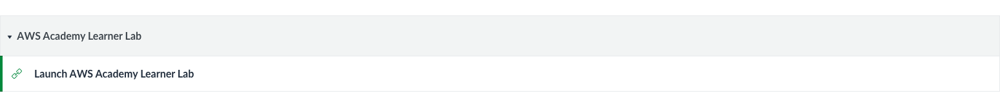
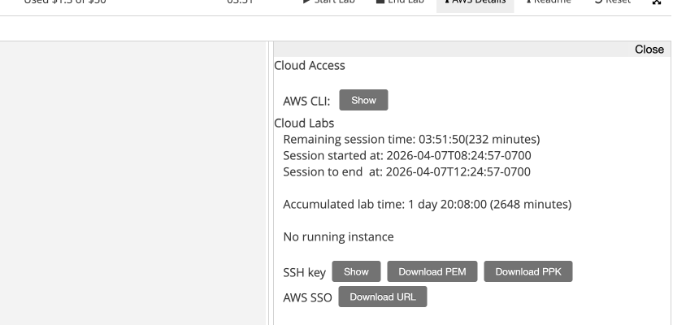
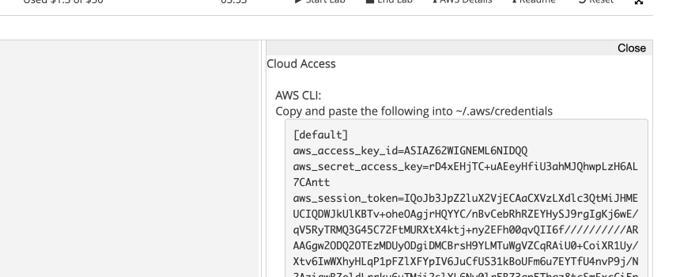

# Lab 09: Distributed File Systems

> For the lab overview, architecture diagrams, and key concepts, see
> [README.md](README.md).

## Choose Your Environment

This lab can run **locally** (Docker Desktop) or on an **EC2 instance**
(AWS Academy). Choose one:

| Environment | What You Need | Setup |
| --- | --- | --- |
| **Option A: Local** | Docker Desktop + bash terminal | `./setup.sh` |
| **Option B: EC2** | AWS Academy credentials + AWS CLI | `bash setup-ec2.sh` |

Both options run the same Docker containers and the same 8 tasks.
Option B is useful if you do not have Docker Desktop or want to
practice launching cloud infrastructure.

## Option A: Local Setup (Docker Desktop)

### Prerequisites

- **Docker Desktop** installed and running
- **AWS CLI** installed (Tasks 6-7 require it; AWS Academy credentials
  needed for Task 7)
- A terminal that supports bash (macOS Terminal, Linux shell, Git Bash
  on Windows, or WSL)

**Verify Docker:**

```bash
docker --version
docker compose version
```

### Quick Start

```bash
cd 09-distributed-file-systems
chmod +x setup.sh cleanup.sh scripts/*.sh
./setup.sh
```

Then skip to **Task 1** below.

## Option B: EC2 Setup (AWS Academy)

### Step 1: Get AWS Academy Credentials

Log in to your AWS Academy Learner Lab course and start a session:

1. Go to **Modules** and click **Launch AWS Academy Learner Lab**

   

2. Click **Start Lab** and wait for the AWS indicator to turn
   **green** (takes about 30 seconds)

   

3. Click **AWS Details** to open the Cloud Access panel

   

4. Click **Show** next to "AWS CLI" and copy the credentials block

   

### Step 2: Export the Credentials

Paste the credentials into your terminal:

```bash
export AWS_ACCESS_KEY_ID=YOUR_ACCESS_KEY
export AWS_SECRET_ACCESS_KEY=YOUR_SECRET_KEY
export AWS_SESSION_TOKEN=YOUR_SESSION_TOKEN
export AWS_DEFAULT_REGION=us-east-1
```

### Step 3: Launch the EC2 Instance

```bash
bash setup-ec2.sh
```

The script creates a t3.medium Amazon Linux 2023 instance, installs
Docker and Docker Compose, clones the repository, and runs `setup.sh`
automatically. It takes 2-3 minutes.

### Step 4: SSH into the Instance

```bash
ssh -i lab09-key.pem ec2-user@YOUR_PUBLIC_IP
```

The public IP is printed by the setup script. Once inside:

```bash
cd ~/system-design-course/09-distributed-file-systems
ls ~/LAB_READY   # confirms setup is complete
```

Then continue with **Task 1** below. All commands run the same way
on EC2 as they do locally.

### EC2 Cleanup

When you are done with the lab:

```bash
bash cleanup-ec2.sh
```

This terminates the instance, deletes the key pair, and removes the
security group.

---

## Task 1: Start the Environment

Start the lab infrastructure: an NFS server with two NFS clients and a MinIO
object storage server with four erasure-coded drives.

### Step 1.1: Verify Docker is installed

```bash
docker --version
docker compose version
```

### Step 1.2: Run the setup script

```bash
./setup.sh
```

The script builds the NFS server and client images, starts all containers,
waits for health checks to pass, and verifies NFS mounts and MinIO health.

Expected output (abbreviated):

```text
=== Lab 09: Distributed File Systems (NFS + MinIO) ===

Checking prerequisites...
  Docker:         Docker version 27.x.x, build ...
  Docker Compose: 2.x.x

Building and starting NFS server, NFS clients, and MinIO...
...
  NFS Server: ready (3 exports configured)
  MinIO:      ready (4-drive erasure coding)
...
=== Environment ready ===
```

### Step 1.3: Verify NFS server exports

```bash
docker exec nfs-server exportfs -v
```

Expected output:

```text
/nfs/shared     <world>(rw,wdelay,no_root_squash,no_subtree_check,...)
/nfs/data       <world>(rw,wdelay,no_root_squash,no_subtree_check,...)
/nfs/backup     <world>(ro,wdelay,no_root_squash,no_subtree_check,...)
```

### Step 1.4: Verify MinIO health

```bash
curl http://localhost:9000/minio/health/live
```

A successful response returns HTTP 200 with no body. Verify the HTTP
status code explicitly:

```bash
curl -o /dev/null -s -w "%{http_code}\n" http://localhost:9000/minio/health/live
```

Expected output:

```text
200
```

### Step 1.5: Open the MinIO web console

Open <http://localhost:9001> in your browser and log in with:

- **Username:** `minioadmin`
- **Password:** `minioadmin123`

You should see the MinIO console dashboard. No buckets exist yet -- you
will create them in Task 4.

> **Question:** What services does the `docker-compose.yml` define? What
> is the purpose of each?
>
> **Hint:** Look at the service names, the images or build contexts they
> use, and how they depend on each other.

---

## Task 2: NFS Server Configuration

Understand how the NFS server exposes directories to clients and what the
export options mean for security and performance.

### Step 2.1: Inspect the exports file

```bash
docker exec nfs-server cat /etc/exports
```

Expected output:

```text
/nfs/shared  *(rw,sync,no_subtree_check,no_root_squash)
/nfs/data    *(rw,sync,no_subtree_check,no_root_squash)
/nfs/backup  *(ro,sync,no_subtree_check,no_root_squash)
```

Three directories are exported. The `*` means any client can connect. Each
export has different options that control access and behavior.

### Step 2.2: Understand export options

Review each option:

| Option | Meaning |
| --- | --- |
| `rw` | Read-write access |
| `ro` | Read-only access |
| `sync` | Write to disk before acknowledging (safer, slower) |
| `no_root_squash` | Remote root user retains root privileges on the server |
| `no_subtree_check` | Skip subtree checking for better reliability |

### Step 2.3: Verify exports are active

```bash
docker exec nfs-server showmount -e localhost
```

Expected output:

```text
Export list for localhost:
/nfs/backup *
/nfs/data   *
/nfs/shared *
```

### Step 2.4: Check NFS server processes

```bash
docker exec nfs-server ps aux
```

Look for `rpc.nfsd`, `rpc.mountd`, and `rpcbind` in the output. These are
the core NFS server daemons.

> **Question:** What does `no_root_squash` mean? Why is it a security risk
> in production?
>
> **Hint:** Consider what happens when a remote user with UID 0 writes files
> to the NFS share.
>
> **Question:** What is the difference between `sync` and `async` in NFS
> exports?
>
> **Hint:** Think about what happens if the server crashes before data is
> written to disk.

---

## Task 3: NFS Client Operations and Concurrency

Explore NFS from the client side. Write and read files across two clients
to observe shared filesystem behavior, then test concurrency and locking.

### Step 3.1: Exec into client-1

```bash
docker exec -it nfs-client-1 bash
```

You are now inside the NFS client container.

### Step 3.2: Verify NFS mounts

```bash
df -h | grep nfs
mount | grep nfs
```

Expected output shows three NFS mounts: `/mnt/shared`, `/mnt/data`, and
`/mnt/backup`.

### Step 3.3: Read server-created files

The NFS server created sample files during startup. Verify you can read them:

```bash
cat /mnt/shared/welcome.txt
```

Expected output:

```text
Shared configuration file - created by NFS server
```

### Step 3.4: Write from client-1

```bash
echo "Written by client-1 at $(date)" > /mnt/shared/client1.txt
cat /mnt/shared/client1.txt
```

### Step 3.5: Read from client-2

Open a **new terminal** and exec into client-2:

```bash
docker exec -it nfs-client-2 bash
```

Read the file written by client-1:

```bash
cat /mnt/shared/client1.txt
```

You should see the exact content written by client-1. Both clients share
the same filesystem.

### Step 3.6: Write from client-2

Still inside client-2:

```bash
echo "Written by client-2 at $(date)" > /mnt/shared/client2.txt
```

### Step 3.7: Verify synchronization

From either client, verify both files exist:

```bash
ls -la /mnt/shared/
```

Expected output shows `welcome.txt`, `client1.txt`, and `client2.txt` --
files created by the server and both clients are all visible.

### Step 3.8: Test read-only enforcement

The `/mnt/backup` mount is exported as `ro` (read-only). Try writing to it:

```bash
echo "test" > /mnt/backup/fail.txt
```

Expected output:

```text
bash: /mnt/backup/fail.txt: Read-only file system
```

### Step 3.9: Concurrent write test

From **client-1**, run 10 background writes:

```bash
for i in $(seq 1 10); do
    echo "Client-1 write $i at $(date)" >> /mnt/data/concurrent.log &
done
wait
```

From **client-2**, run 10 more:

```bash
for i in $(seq 1 10); do
    echo "Client-2 write $i at $(date)" >> /mnt/data/concurrent.log &
done
wait
```

Then from either client, count the lines:

```bash
wc -l /mnt/data/concurrent.log
```

Expected output:

```text
20 /mnt/data/concurrent.log
```

All 20 writes were captured, but inspect the file to see if writes are
interleaved:

```bash
cat /mnt/data/concurrent.log
```

### Step 3.10: File locking test with flock

From **client-1**, acquire an exclusive lock and hold it for 5 seconds:

```bash
flock /mnt/data/lockfile.lock -c 'echo "Lock held by client-1"; sleep 5; echo "Released"'
```

While that command is running, immediately switch to **client-2** and try
to acquire the same lock with `-n` (non-blocking):

```bash
flock -n /mnt/data/lockfile.lock -c 'echo "Got lock"' || echo "Lock is held by another process"
```

Expected output on client-2:

```text
Lock is held by another process
```

After the 5-second sleep on client-1, retry on client-2 and it will succeed.

> **Question:** What happens when two clients write to the same file
> simultaneously without locking?
>
> **Hint:** Review the contents of `concurrent.log`. Are all lines complete
> or could they be corrupted?
>
> **Question:** NFS provides POSIX semantics. What does this mean for
> existing applications?
>
> **Hint:** Think about whether an application that works with a local
> filesystem needs code changes to work with NFS.

---

## Task 4: MinIO Buckets and Basic Operations

MinIO is an S3-compatible object storage server. In this task you will
create buckets and explore the MinIO client (mc) tool.

### Step 4.1: Start the mc client container

```bash
docker compose --profile tools run --rm mc
```

This drops you into a shell inside the MinIO client container.

### Step 4.2: Configure the MinIO alias

```bash
mc alias set local http://minio:9000 minioadmin minioadmin123
```

Expected output:

```text
Added `local` successfully.
```

### Step 4.3: Check server info

```bash
mc admin info local
```

This shows the MinIO server version, uptime, and storage information
including the four drives used for erasure coding.

### Step 4.4: Create buckets

```bash
mc mb local/distributed-files
mc mb local/application-data
mc mb local/system-backups
```

Expected output for each:

```text
Bucket created successfully `local/distributed-files`.
```

### Step 4.5: List buckets

```bash
mc ls local
```

Expected output:

```text
[2025-01-01 00:00:00 UTC]     0B distributed-files/
[2025-01-01 00:00:00 UTC]     0B application-data/
[2025-01-01 00:00:00 UTC]     0B system-backups/
```

### Step 4.6: Verify in the web console

Exit the mc container:

```bash
exit
```

Open <http://localhost:9001> in your browser, log in, and browse the
buckets you just created. You should see all three listed.

> **Question:** How do MinIO buckets differ from NFS directories?
>
> **Hint:** Consider how objects are addressed, whether you can `cd` into
> a bucket, and how permissions are managed.
>
> **Question:** MinIO implements the S3 API. What advantage does this
> provide over a custom API?
>
> **Hint:** Think about tool compatibility, migration paths, and developer
> familiarity.

---

## Task 5: Object Storage Operations

Upload, download, sync, version, and manage objects using the mc client.
These operations mirror what you would do with AWS S3.

### Step 5.1: Start mc and create test files

```bash
docker compose --profile tools run --rm mc
```

Inside the container, create test files:

```bash
mc alias set local http://minio:9000 minioadmin minioadmin123
echo "Application config v1.0" > /tmp/config.json
echo "User data export" > /tmp/users.csv
echo "System log entry" > /tmp/app.log
```

### Step 5.2: Upload an individual file

```bash
mc cp /tmp/config.json local/application-data/
```

Expected output:

```text
/tmp/config.json: 24 B / 24 B
```

### Step 5.3: Upload with metadata

```bash
mc cp /tmp/users.csv local/application-data/ \
    --attr "department=engineering,version=2.0"
```

### Step 5.4: List objects

```bash
mc ls local/application-data/
```

Expected output:

```text
[2025-01-01 00:00:00 UTC]    24B STANDARD config.json
[2025-01-01 00:00:00 UTC]    17B STANDARD users.csv
```

### Step 5.5: Download an object

```bash
mc cp local/application-data/config.json /tmp/downloaded-config.json
cat /tmp/downloaded-config.json
```

Expected output:

```text
Application config v1.0
```

### Step 5.6: Sync a directory (mc mirror)

Create a project directory structure and sync it to MinIO:

```bash
mkdir -p /tmp/project/{css,js,docs}
echo "body { color: black; }" > /tmp/project/css/style.css
echo "console.log('hello');" > /tmp/project/js/app.js
echo "# Project Docs" > /tmp/project/docs/README.md
mc mirror /tmp/project/ local/distributed-files/project/
```

Verify the upload:

```bash
mc ls local/distributed-files/project/ --recursive
```

Expected output:

```text
[2025-01-01 00:00:00 UTC]    24B STANDARD css/style.css
[2025-01-01 00:00:00 UTC]    16B STANDARD docs/README.md
[2025-01-01 00:00:00 UTC]    24B STANDARD js/app.js
```

### Step 5.7: Delete objects

Delete a single object:

```bash
mc rm local/distributed-files/project/docs/README.md
```

Delete remaining objects recursively:

```bash
mc rm local/distributed-files/project/ --recursive --force
```

### Step 5.8: Generate a presigned URL

```bash
mc share download local/application-data/config.json --expire 1h
```

The output is a URL that allows anyone to download the file without
credentials for one hour.

### Step 5.9: Enable versioning

```bash
mc version enable local/application-data
```

Upload the same file twice with different content:

```bash
echo "Application config v2.0 - updated" > /tmp/config.json
mc cp /tmp/config.json local/application-data/
echo "Application config v3.0 - final" > /tmp/config.json
mc cp /tmp/config.json local/application-data/
```

List all versions:

```bash
mc ls local/application-data/config.json --versions
```

You should see multiple versions of the same file with different version
IDs.

> **Question:** Object storage does not support in-place modification. How
> does this differ from NFS?
>
> **Hint:** In NFS you can open a file, seek to a position, and overwrite
> bytes. What must you do in object storage to change a single byte?
>
> **Question:** When would you use a presigned URL in a real application?
>
> **Hint:** Think about allowing temporary access to private objects
> without sharing credentials.

---

## Task 6: Erasure Coding and Fault Tolerance

MinIO uses erasure coding to protect data across its four drives. In this
task you will simulate a drive failure and observe that data remains
accessible.

### Step 6.1: Run the erasure coding demo

Exit the mc container if you are still inside it, then run from the host:

```bash
bash scripts/erasure-coding-demo.sh
```

The script uploads a test file, deletes the contents of one drive, and
verifies the file is still readable.

Expected output (abbreviated):

```text
--- Step 1: Create test bucket and upload data ---
  Uploaded test-file.txt to erasure-test

--- Step 4: Simulating drive failure (removing data from drive 3) ---
  Drive 3 (/data3) contents deleted.

--- Step 5: Verify file is STILL readable after drive failure ---
  SUCCESS: File is still readable despite drive failure!
  Content:
This file tests erasure coding fault tolerance.
If you can read this after a drive failure, erasure coding works!
```

### Step 6.2: Walk through the script

Read the script to understand each step:

```bash
cat scripts/erasure-coding-demo.sh
```

The script does the following:

1. Creates a test bucket and uploads a file
2. Verifies the file is readable
3. Deletes the contents of drive 3 (`/data3`) to simulate a failure
4. Verifies the file is still accessible despite the drive loss
5. Cleans up the test bucket

### Step 6.3: Check MinIO cluster health

```bash
curl -o /dev/null -s -w "%{http_code}\n" http://localhost:9000/minio/health/cluster
```

Expected output:

```text
200
```

### Step 6.4: Restart MinIO to restore the drive

```bash
docker compose restart minio
```

This recreates the volume mount for `/data3`, restoring the drive.

> **Question:** MinIO uses EC:2 parity with 4 drives. What is the maximum
> number of drives that can fail without data loss?
>
> **Hint:** EC:2 means 2 parity shards. The formula is: max failures =
> parity count.
>
> **Question:** How does erasure coding compare to HDFS 3x replication in
> storage efficiency?
>
> **Hint:** With 3x replication, storing 1 GB requires 3 GB of raw
> storage. How much does EC:2 with 4 drives require?
>
> **Question:** In CAP theorem terms, what does MinIO prioritize?
>
> **Hint:** Consider what happens during a network partition -- does MinIO
> continue accepting writes or does it refuse them to maintain consistency?

---

## Task 7: MinIO vs AWS S3 Comparison

Run identical S3 API operations against local MinIO and AWS S3 to compare
behavior and latency. This task requires AWS Academy credentials.

### Step 7.1: Configure AWS credentials inside the client container

Pass your AWS Academy credentials when running the comparison script
inside the `nfs-client-1` container:

```bash
docker exec -it \
    -e AWS_ACCESS_KEY_ID=YOUR_ACCESS_KEY \
    -e AWS_SECRET_ACCESS_KEY=YOUR_SECRET_KEY \
    -e AWS_SESSION_TOKEN=YOUR_SESSION_TOKEN \
    -e AWS_DEFAULT_REGION=us-east-1 \
    nfs-client-1 bash
```

Replace the placeholder values with your AWS Academy credentials from
the Learner Lab.

### Step 7.2: Verify AWS identity

Inside the container:

```bash
aws sts get-caller-identity
```

Expected output:

```json
{
    "UserId": "AROA...:user...",
    "Account": "123456789012",
    "Arn": "arn:aws:sts::123456789012:assumed-role/..."
}
```

### Step 7.3: Run the comparison script

Still inside the container:

```bash
bash /scripts/compare-s3.sh
```

The script creates a bucket, uploads a file, lists objects, and syncs a
directory on both MinIO and AWS S3, measuring the latency for each
operation.

### Step 7.4: Analyze the results

The script prints a latency comparison table:

```text
=============================================
  Latency Comparison (milliseconds)
=============================================
  Operation                 MinIO      AWS S3
  --------------------  ----------  ----------
  Create Bucket                 XX         XX
  Upload File                   XX         XX
  List Objects                  XX         XX
  Sync Directory                XX         XX
```

Record the values you observe. MinIO should be significantly faster for
all operations because it runs locally (zero network latency to the
server).

> **Question:** Why is MinIO faster for all operations in this test?
>
> **Hint:** Consider network latency. MinIO runs on localhost; AWS S3 is
> in a data center hundreds of miles away.
>
> **Question:** What advantages does AWS S3 provide that MinIO does not?
>
> **Hint:** Think about durability (11 nines), global availability,
> managed infrastructure, and integration with other AWS services.
>
> **Question:** When would you choose self-hosted MinIO over managed S3?
>
> **Hint:** Consider data sovereignty requirements, bandwidth costs, and
> development/testing scenarios.

---

## Task 8: Performance Comparison and Architecture Analysis

Run a storage benchmark to compare NFS and MinIO performance, then
synthesize everything you learned into an architecture comparison.

### Step 8.1: Run the benchmark

```bash
docker exec -it nfs-client-1 bash /scripts/benchmark.sh
```

The script runs sequential write, sequential read, and random I/O tests
on NFS using fio, then measures MinIO upload and download times.

Expected output (abbreviated):

```text
=============================================
  Storage Performance Benchmark
  NFS vs MinIO (Object Storage)
=============================================

--- NFS: Sequential Write (1 GB, 1 MB blocks) ---
  Write BW: XXXXX KB/s
--- NFS: Sequential Read ---
  Read BW:  XXXXX KB/s
--- NFS: Random 4K Read/Write (70/30 mix) ---
  Read IOPS:  XXXX
  Write IOPS: XXXX

--- MinIO: Timed Upload (256 MB file) ---
  Upload time: XXXX ms
--- MinIO: Timed Download (256 MB file) ---
  Download time: XXXX ms
```

### Step 8.2: Record the comparison

Fill in this table with your observations from all three storage systems:

| Dimension | NFS | MinIO | AWS S3 |
| --- | --- | --- | --- |
| Access model | POSIX filesystem | HTTP REST API (S3) | HTTP REST API (S3) |
| Consistency | Strong (sync mode) | Read-after-write | Read-after-write |
| Scalability | Vertical (single server) | Horizontal (add drives/nodes) | Virtually unlimited |
| Fault tolerance | None (single server) | Erasure coding (EC:2) | 11 nines durability |
| File locking | Yes (flock, fcntl) | No | No |
| Best for | Shared configs, legacy apps | Backups, media, dev/test S3 | Production cloud workloads |

### Step 8.3: Reflection questions

Answer the following questions based on what you observed in this lab:

1. Your company stores 50 TB of video files accessed by a global CDN.
   Which storage system would you choose and why?

2. A legacy application requires shared home directories for 100 Linux
   users on the same network. Which storage model fits best?

3. How does the CAP theorem apply to each of the three storage systems
   you tested (NFS, MinIO, AWS S3)?

> **Hint:** For question 1, consider durability, global distribution, and
> CDN integration. For question 2, consider POSIX compatibility. For
> question 3, think about what each system sacrifices during a network
> partition.

### Step 8.4: Cleanup

```bash
./cleanup.sh
```

---

## Cleanup

If you have not already cleaned up, run:

```bash
./cleanup.sh
```

Verify cleanup:

```bash
docker ps
```

No lab containers (`nfs-server`, `nfs-client-1`, `nfs-client-2`,
`minio-server`) should be running.

```bash
docker volume ls
```

No lab volumes (`nfs-shared`, `nfs-data`, `nfs-backup`, `minio-data1`
through `minio-data4`) should be listed.
