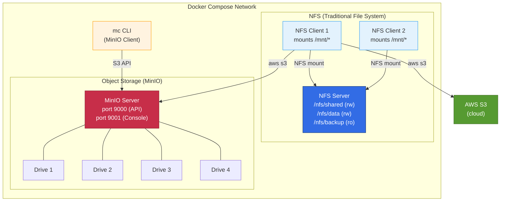
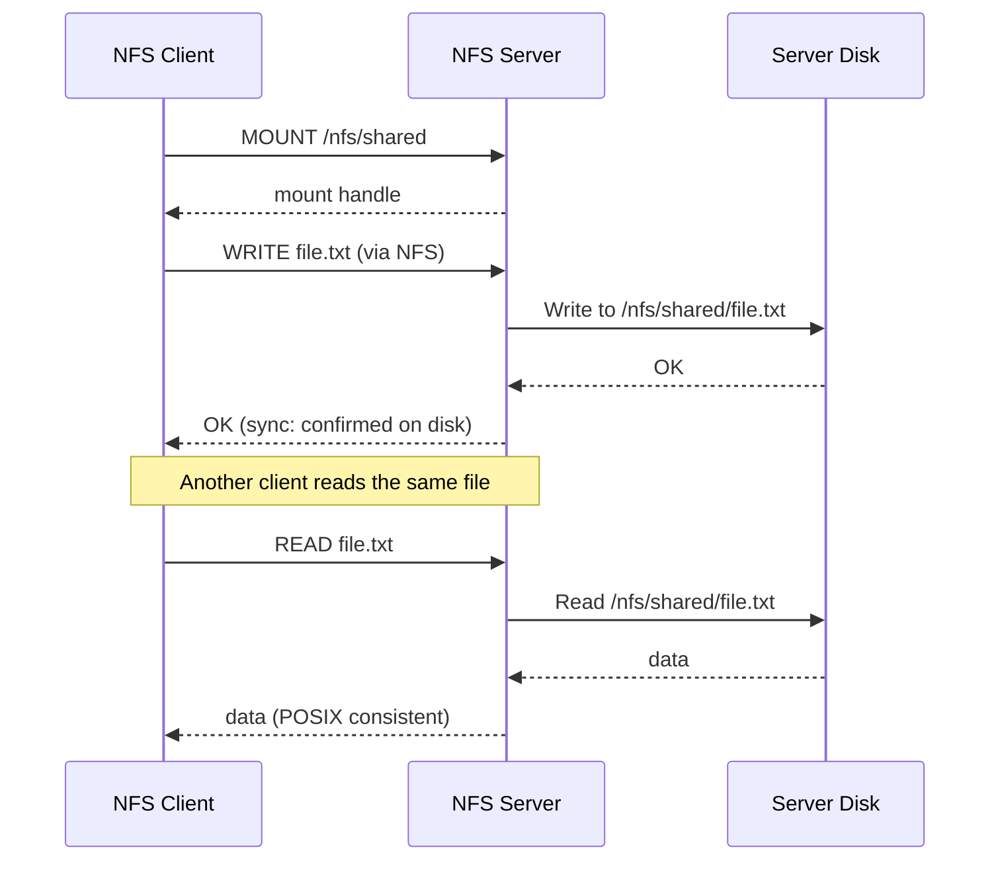
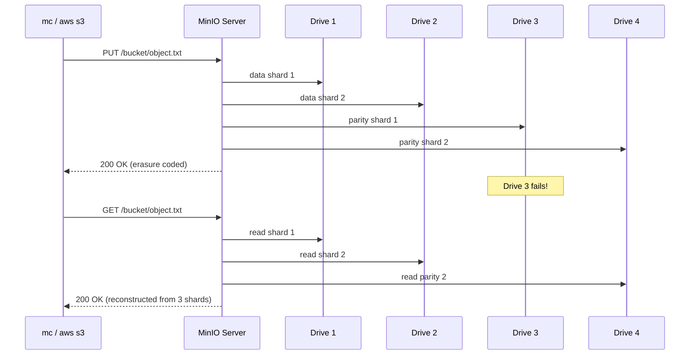

# Distributed File Systems: NFS and MinIO Object Storage


## Overview

This hands-on lab explores two fundamental approaches to distributed
storage: traditional network file systems (NFS) and modern object storage
(MinIO). Students configure an NFS server with multiple clients sharing
files across a network, deploy a MinIO server with erasure coding for
fault tolerance, and compare both against real AWS S3 using identical
CLI commands. Everything runs locally in Docker Compose.

## Lab Instructions

All lab work runs inside Docker containers, making the commands
OS-agnostic. Follow the step-by-step instructions in **[LAB.md](LAB.md)**.
You need a terminal that supports bash (macOS Terminal, Linux shell,
Git Bash on Windows, or WSL).

## Learning Objectives

- Configure an NFS server with multiple exports and permission models
- Mount NFS shares on client machines and verify cross-client file access
- Test concurrent file operations and observe POSIX locking behavior
- Deploy MinIO object storage with erasure coding across 4 drives
- Use the `mc` CLI to create buckets, upload objects, sync directories,
  and generate presigned URLs
- Simulate drive failure and verify data survives via erasure coding
- Run identical `aws s3` commands against MinIO and real AWS S3 to
  compare API compatibility, latency, and behavior
- Analyze trade-offs between file storage and object storage using
  the CAP theorem

## Prerequisites

- **Docker Desktop** installed and running (includes Docker Compose)
- **AWS Academy credentials** (for Task 7: MinIO vs S3 comparison)
- Basic familiarity with Linux command-line operations
- No permanent cloud resources required -- Task 7 uses temporary buckets

## Architecture

The lab environment runs entirely in Docker Compose. An NFS server
exports three directories to two client containers, while a MinIO server
provides S3-compatible object storage with 4-drive erasure coding.



**Two storage models compared:**

- **NFS**: POSIX file system -- hierarchical directories, file locking,
  transparent mounts. Clients access remote files as if they were local.
- **MinIO**: S3-compatible object storage -- flat namespace with buckets,
  HTTP REST API, erasure coding for fault tolerance. Ideal for cloud-native
  applications, backups, and media storage.

## Lab Structure

```text
09-distributed-file-systems/
├── README.md                       # This file (lab overview)
├── LAB.md                          # Step-by-step instructions (8 tasks)
├── docker-compose.yml              # NFS + MinIO + clients
├── setup.sh                        # Start environment
├── cleanup.sh                      # Tear down environment
├── nfs-server/
│   ├── Dockerfile                  # Ubuntu + nfs-kernel-server
│   ├── exports                     # NFS export configuration
│   └── entrypoint.sh               # Initialize and start NFS services
├── nfs-client/
│   ├── Dockerfile                  # Ubuntu + nfs-common + fio + aws-cli
│   └── entrypoint.sh               # Mount NFS exports with retries
└── scripts/
    ├── verify-nfs.sh               # Cross-client NFS verification
    ├── verify-minio.sh             # MinIO health and connectivity check
    ├── benchmark.sh                # NFS vs MinIO performance comparison
    ├── erasure-coding-demo.sh      # Drive failure simulation
    └── compare-s3.sh              # MinIO vs AWS S3 side-by-side
```

## Quick Start

```bash
./setup.sh
```

The setup script builds and starts the NFS server, two NFS clients, and
MinIO, verifies all services are healthy, and prints instructions for
the lab tasks. Follow [LAB.md](LAB.md) for the full 8-task walkthrough.

## Tasks Overview

The lab consists of 8 tasks that build on each other:

| Task | Topic | What You Do |
| --- | --- | --- |
| 1. Start the Environment | Setup | Run setup script, verify services, open MinIO console |
| 2. NFS Server Configuration | NFS exports | Inspect export options (rw, ro, sync, no_root_squash) |
| 3. NFS Client Operations | File sharing | Read/write across clients, file locking, concurrency |
| 4. MinIO Buckets | Object storage | Create buckets with `mc`, explore the web console |
| 5. Object Storage Operations | S3 operations | Upload, sync, delete objects; metadata; presigned URLs |
| 6. Erasure Coding | Fault tolerance | Simulate drive failure, verify data survives |
| 7. MinIO vs AWS S3 | Comparison | Run identical `aws s3` commands against both endpoints |
| 8. Performance and Analysis | Benchmarking | `fio` benchmarks, NFS vs MinIO vs S3, CAP theorem |

## Cleanup

macOS / Linux:

```bash
./cleanup.sh
```

The cleanup script stops all containers, removes volumes, and deletes
locally built Docker images.

## Troubleshooting

| Issue | Cause | Fix |
| --- | --- | --- |
| `docker: command not found` | Docker not installed | Install Docker Desktop |
| `Cannot connect to the Docker daemon` | Docker not running | Start Docker Desktop |
| NFS server fails to start | Missing kernel NFS support | Ensure Docker Desktop is updated; privileged mode required |
| `mount.nfs: access denied` | NFS server not ready yet | Wait for health check; re-run `./setup.sh` |
| NFS mount hangs | Firewall blocking port 2049 | Check Docker network; restart Docker Desktop |
| `port 9000 already in use` | Another service on port 9000 | Stop conflicting service or change port in docker-compose.yml |
| `port 9001 already in use` | Another service on port 9001 | Stop conflicting service or change port in docker-compose.yml |
| MinIO console shows no drives | Volumes not mounted | Run `docker compose down -v` then `./setup.sh` |
| `mc: command not found` | Using `mc` outside container | Run `docker compose --profile tools run --rm mc` |
| Erasure coding demo fails | MinIO needs 4 drives | Ensure all 4 volumes exist; restart MinIO |
| AWS S3 comparison fails | Missing credentials | Configure AWS Academy credentials before Task 7 |
| `fio` benchmark slow on macOS | Docker Desktop I/O overhead | Expected -- Docker file sharing adds latency on macOS |
| Cleanup leaves containers running | Privileged NFS containers resist SIGTERM | Restart Docker Desktop to force-kill |

## Key Concepts

| Concept | Description |
| --- | --- |
| **NFS** | Network File System: mounts remote directories as local paths |
| **POSIX Semantics** | Standard file operations (read, write, lock, seek) work transparently |
| **NFS Exports** | Directories shared by the NFS server with access control options |
| **Object Storage** | Flat namespace storing objects (data + metadata) in buckets via HTTP API |
| **MinIO** | Self-hosted, S3-compatible object storage with erasure coding |
| **Bucket** | Top-level container for objects in S3/MinIO (analogous to a root directory) |
| **Erasure Coding** | Data protection that splits data into fragments with parity for recovery |
| **Replication Factor** | Number of copies of data maintained across nodes (HDFS: typically 3x) |
| **CAP Theorem** | Distributed systems can guarantee at most 2 of: Consistency, Availability, Partition tolerance |
| **Presigned URL** | Temporary URL granting time-limited access to a private object |
| **File Locking** | NFS supports advisory/mandatory locks; object storage does not |
| **S3 API** | RESTful interface for object storage (create bucket, put/get/delete object) |

### NFS Data Flow



### Object Storage Data Flow



### Storage Model Decision Guide

```text
                  ┌───────────────────────┐
                  │ What type of access    │
                  │ does your app need?    │
                  └───────────┬───────────┘
                 ┌─────────────┴─────────────┐
                 ▼                           ▼
        Random read/write            Sequential read/write
        (edit in place)              (upload once, read many)
                 │                           │
         ┌───────┴───────┐           ┌───────┴───────┐
         │ Need POSIX    │           │ Need massive   │
         │ semantics?    │           │ scale + HTTP?  │
         └───┬───────┬───┘           └───┬───────┬───┘
             ▼       ▼                   ▼       ▼
           Yes      No                Yes      No
             │       │                   │       │
             ▼       ▼                   ▼       ▼
           NFS    Consider           Object    Block
                  either            Storage   Storage
                                 (MinIO/S3)  (EBS/iSCSI)
```

## How This Relates to Scalable Systems Design

**Storage is a non-functional requirement that must be decided early.**
The choice between file storage and object storage affects how
applications read and write data, how the system scales, and what
failure modes are possible. Changing storage models after launch is
one of the most expensive migrations in system design.

**NFS provides transparency at the cost of scalability.** Applications
written for local filesystems work on NFS without modification -- that
is the power of POSIX semantics. However, NFS scales vertically (bigger
server) rather than horizontally (more servers). A single NFS server
becomes a bottleneck and a single point of failure. This is why NFS
is common for shared configuration, home directories, and legacy
applications, but not for web-scale workloads.

**Object storage trades POSIX semantics for horizontal scalability.**
MinIO and S3 use a flat namespace with HTTP APIs instead of a
hierarchical filesystem. You cannot `cd` into a bucket or `flock` an
object. In return, you get virtually unlimited storage, built-in
replication or erasure coding, and an API that works identically
whether the storage is local (MinIO) or in the cloud (S3). This is
why every major cloud provider uses object storage as the foundation
for services like static website hosting, data lakes, and backups.

**Erasure coding is more storage-efficient than replication.** HDFS
replicates each block 3 times (300% overhead). MinIO with EC:2 parity
on 4 drives provides comparable fault tolerance at roughly 100%
overhead. The tradeoff is CPU cost -- erasure coding requires
computation to encode and reconstruct data, while replication is a
simple copy. For large-scale storage, the space savings outweigh the
compute cost.

**The CAP theorem shapes storage design decisions.** NFS with `sync`
mode prioritizes consistency (C) and availability (A) but cannot
tolerate network partitions. MinIO prioritizes consistency and partition
tolerance (CP) -- if a quorum of drives is unavailable, writes fail
rather than risking inconsistency. AWS S3 provides read-after-write
consistency with eventual consistency for overwrites, prioritizing
availability. Understanding these tradeoffs helps you choose the right
storage for each use case.

**Connection to earlier labs:** The load balancing concepts from Lab 03
can distribute storage requests across multiple MinIO nodes. The
security patterns from Lab 06 apply to storage access control --
bucket policies, presigned URLs, and encryption at rest. The caching
patterns from Lab 11 complement both storage models: cache frequently
accessed objects in Redis to reduce storage I/O.

## Conclusions

After completing this lab, you should take away these lessons:

1. **NFS and object storage solve fundamentally different problems.**
   NFS provides transparent file access with POSIX semantics, ideal
   for applications that need to read and write files like a local
   disk. Object storage provides scalable, durable storage via HTTP
   APIs, ideal for media, backups, and cloud-native applications.
   Neither replaces the other.

2. **Erasure coding protects data more efficiently than replication.**
   With 4 drives and EC:2 parity, MinIO tolerates 2 drive failures
   at 100% storage overhead. HDFS achieves similar fault tolerance
   with 3x replication at 200% overhead. Erasure coding is the
   standard for modern object storage systems.

3. **MinIO is a true S3-compatible appliance.** The same `aws s3`
   commands work against MinIO and AWS S3. This means applications
   can run locally during development (MinIO) and in production (S3)
   without code changes -- only the endpoint URL differs.

4. **The CAP theorem is not academic -- it drives real design
   decisions.** NFS with `sync` gives you strong consistency but no
   partition tolerance. MinIO chooses consistency over availability.
   S3 provides read-after-write consistency with high availability.
   Each choice has consequences for application behavior during
   failures.

5. **Storage architecture must match access patterns.** Random I/O
   workloads (databases, shared home directories) need file or block
   storage. Sequential I/O workloads (log archives, media delivery,
   data lakes) perform better on object storage. Choosing the wrong
   model creates performance problems that cannot be solved by adding
   hardware.

## Next Steps

- [Module 10 -- Databases](../10-databases/) -- explore how databases
  use storage underneath and add query, indexing, and transaction layers
- [MinIO Documentation](https://min.io/docs/minio/linux/index.html) --
  deep dive into distributed MinIO deployments, bucket policies, and
  lifecycle rules
- [NFS v4 RFC 7530](https://datatracker.ietf.org/doc/html/rfc7530) --
  the protocol specification for NFSv4
- [AWS S3 Documentation](https://docs.aws.amazon.com/s3/) -- managed
  object storage with versioning, lifecycle, and cross-region replication
