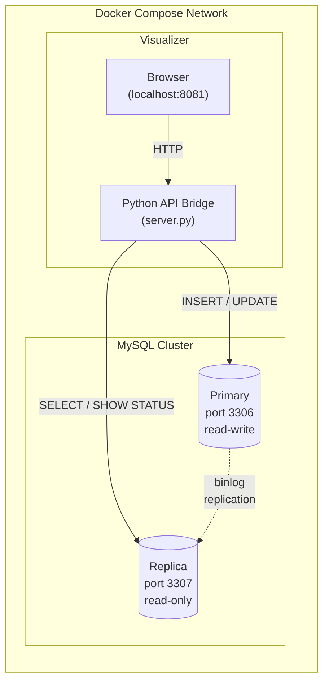

# Database Scalability: Replication, Consistency, and Indexing


## Overview

This hands-on lab explores three fundamental database scalability
mechanisms: replication (distributing reads across nodes), ACID
transactions (guaranteeing consistency under concurrency), and indexing
(optimizing query performance on large tables). Students interact with
a live MySQL primary-replica cluster through an interactive web
visualizer that animates real SQL operations, measures latency, and
includes a built-in SQL console. Optional CLI labs extend the same
concepts to MongoDB (document store) and Cassandra (wide-column store).

## Lab Instructions

The main lab runs in the browser. Follow the step-by-step instructions
in **[visualizer/LAB-VISUALIZER.md](visualizer/LAB-VISUALIZER.md)**.

| Environment | Requirements | Setup |
| --- | --- | --- |
| **Local** (Docker Desktop) | Docker Desktop + browser | `cd visualizer && ./setup.sh` |
| **EC2** (AWS Academy) | Browser only | Upload `visualizer/cloudformation.yaml` via AWS Console |

For optional CLI-based labs with MongoDB and Cassandra, see
[LAB.md](LAB.md).

## Learning Objectives

- Configure and verify MySQL GTID-based primary-replica replication
- Observe replication lag and understand how read replicas scale reads
- Execute ACID transactions and see atomicity in action (commit vs
  rollback)
- Use EXPLAIN to compare query execution plans with and without indexes
- Run SQL directly against primary and replica nodes via the built-in
  console
- Compare how MySQL, MongoDB, and Cassandra each implement replication,
  consistency, and schema design (optional labs)

## Prerequisites

- **Docker Desktop** installed and running (includes Docker Compose)
- A web browser (Chrome, Firefox, or Safari)
- Basic SQL knowledge (SELECT, INSERT, UPDATE)
- No cloud account required for local Docker; AWS Academy credentials
  required for the EC2 option

## Architecture

The visualizer connects to a live MySQL primary-replica cluster. Every
button click and console query executes real SQL against real databases.
The same Docker Compose stack runs locally or on an EC2 instance via
CloudFormation.



**Data flow:**

1. The browser sends HTTP requests to the Python API bridge
1. The API executes real SQL on the primary (writes) or replica (reads)
1. The primary replicates changes to the replica via GTID-based binlog
1. The browser animates the data flow with measured latency

## Lab Structure

```text
10-databases/
├── README.md                           # This file (lab overview)
├── LAB.md                              # Full lab index with comparison table
├── visualizer/                         # Main lab (interactive browser)
│   ├── LAB-VISUALIZER.md              # Step-by-step instructions (5 tasks)
│   ├── docker-compose.yml             # MySQL primary + replica + visualizer
│   ├── cloudformation.yaml            # EC2 deployment (AWS Academy)
│   ├── setup.sh / cleanup.sh          # Start and stop environment
│   ├── Dockerfile                     # Python API bridge image
│   ├── server.py                      # API bridge (proxies SQL to MySQL)
│   ├── index.html                     # Interactive UI with SVG diagram
│   ├── app.js                         # Animation engine and SQL console
│   └── style.css                      # Dark theme styling
├── mysql/                              # Optional: MySQL CLI lab
│   ├── LAB-MYSQL.md                   # 4 tasks (replication, ACID, indexing)
│   ├── docker-compose.yml             # MySQL primary + replica
│   ├── cloudformation.yaml            # EC2 deployment template
│   ├── setup.sh / cleanup.sh
│   └── init/primary-init.sql          # Schema and seed data
├── mongodb/                            # Optional: MongoDB CLI lab
│   ├── LAB-MONGODB.md                 # 4 tasks (replica set, consistency)
│   ├── docker-compose.yml             # 3-node replica set
│   ├── cloudformation.yaml
│   ├── setup.sh / cleanup.sh
│   └── init/rs-init.js                # Replica set initialization
├── cassandra/                          # Optional: Cassandra CLI lab
│   ├── LAB-CASSANDRA.md               # 4 tasks (ring, consistency levels)
│   ├── docker-compose.yml             # 3-node cluster (RF=3)
│   ├── cloudformation.yaml
│   ├── setup.sh / cleanup.sh
│   └── init/schema.cql               # Keyspace and table creation
└── presentation/                       # Module slide deck
    └── index.html
```

## Quick Start

**Local (Docker Desktop):**

```bash
cd visualizer
./setup.sh
```

Open [http://localhost:8081](http://localhost:8081).

**EC2 (AWS Academy):** Upload `visualizer/cloudformation.yaml` to
CloudFormation. When the stack completes (~5-10 min), open the
**VisualizerURL** from the Outputs tab.

The visualizer has three tabs (Replication, Consistency, Schema &
Indexing) and a SQL console at the bottom. Follow
[LAB-VISUALIZER.md](visualizer/LAB-VISUALIZER.md) for the guided
walkthrough.

## Tasks Overview

### Main Lab (Interactive Visualizer, ~45 min)

| Task | Topic | What You Do |
| --- | --- | --- |
| 1. Explore the Environment | Setup | Inspect schema, verify replication, use SQL console |
| 2. Replication | Scaling reads | Write to primary, read from replica, observe lag |
| 3. ACID Transactions | Consistency | Transfer enrollment atomically, trigger rollback |
| 4. Indexing | Query optimization | EXPLAIN with/without index, compare rows scanned |
| 5. Free Exploration | SQL console | Run arbitrary queries, compare primary vs replica |

### Optional CLI Labs (~30 min each)

| Lab | Database | Scalability Mechanisms |
| --- | --- | --- |
| [10A: MySQL](mysql/LAB-MYSQL.md) | MySQL 8 | GTID replication, ACID, indexing |
| [10B: MongoDB](mongodb/LAB-MONGODB.md) | MongoDB 7 | Replica set, read/write concerns, denormalization |
| [10C: Cassandra](cassandra/LAB-CASSANDRA.md) | Cassandra 4.1 | Multi-node ring, tunable consistency, partition keys |

## Cleanup

```bash
cd visualizer
./cleanup.sh
```

## Troubleshooting

| Issue | Cause | Fix |
| --- | --- | --- |
| Port 8081 in use | Another service running | Change port in `visualizer/docker-compose.yml` |
| SQL Console shows error | Blocked SQL command | Some DDL commands are blocked for safety |
| Replica shows `--` in sidebar | Replication not configured | Re-run `./setup.sh` |
| EXPLAIN shows `rows: 1` | Table stats stale | Run `ANALYZE TABLE access_log;` in the console |
| Animation stuck | Previous operation running | Wait for it to finish or refresh the page |
| Port 3306 in use | Local MySQL running | Stop local MySQL or change port in docker-compose |
| Cassandra OOM crash | Not enough Docker memory | Allocate at least 4 GB RAM in Docker Desktop |
| EC2 page does not load | Stack still initializing | Wait 5-10 min after CREATE_COMPLETE for Docker setup |
| EC2 stack create fails | Learner Lab not started | Ensure the AWS indicator is green before creating the stack |

## Key Concepts

| Concept | Description |
| --- | --- |
| **Replication** | Copying data from a primary to replicas via binary log |
| **Read replica** | A read-only copy that offloads SELECT queries from the primary |
| **Replication lag** | Delay between a write on primary and its appearance on replica |
| **ACID** | Atomicity, Consistency, Isolation, Durability -- transaction guarantees |
| **Atomicity** | A transaction either fully succeeds (COMMIT) or fully fails (ROLLBACK) |
| **BASE** | Basically Available, Soft state, Eventually consistent -- NoSQL trade-off |
| **Full table scan** | MySQL reads every row to find matches -- slow on large tables |
| **Composite index** | An index on multiple columns for multi-column WHERE clauses |
| **EXPLAIN** | Shows MySQL's query plan: index used, rows examined |
| **Read-write split** | Send writes to primary, reads to replicas |
| **Partition key** | Determines data distribution across nodes (Cassandra, DynamoDB) |
| **Write concern** | How many nodes must acknowledge a write (MongoDB) |
| **Consistency level** | How many replicas must respond for a read/write (Cassandra) |

## How This Relates to Scalable Systems Design

**Replication is the most common first step in scaling a relational
database.** Adding read replicas distributes SELECT queries across
multiple nodes, but all writes still go to one primary. At companies
like Facebook, MySQL read replicas serve billions of reads per day
while a single primary cluster handles writes. When even the primary
becomes a bottleneck, sharding distributes writes -- but that is a
fundamentally harder problem.

**ACID transactions prevent data corruption under concurrency.** When
two users try to book the last seat on a flight simultaneously, only
one succeeds. Without atomicity, a transfer that debits one account
but fails to credit another causes money to vanish. ACID is
non-negotiable for banking, inventory, and healthcare systems. NoSQL
databases trade ACID for BASE (Basically Available, Soft state,
Eventually consistent) to achieve higher throughput and availability.

**Indexing is the highest-impact optimization for query performance.**
A single composite index can turn a 10,000-row scan into a 24-row
lookup -- a 400x improvement with no application code changes. But
indexes are not free: they consume storage, slow down writes, and must
match your query patterns. Over-indexing is as harmful as
under-indexing.

**Connection to earlier labs:** The caching patterns from Lab 11 sit
in front of databases -- a Redis cache with 90% hit rate reduces
database load by 10x. The load balancing from Lab 03 distributes
application traffic, but read-write splitting requires the load
balancer to route based on query type. The security patterns from
Lab 06 apply to database access control -- connection credentials,
network isolation (Lab 08 VPC), and encryption at rest.

## Conclusions

After completing this lab, you should take away these lessons:

1. **Replication scales reads, not writes.** Adding replicas distributes
   SELECT queries across multiple nodes, but all writes still go to one
   primary. This is the most common first step in scaling a database.

2. **ACID prevents data corruption under concurrency.** The enrollment
   transfer either fully succeeds or fully rolls back. Without
   atomicity, partial failures leave the database in an inconsistent
   state.

3. **Indexes are the highest-impact optimization.** A composite index
   turned a 10,000-row scan into a 24-row lookup. But indexes slow
   down writes and consume storage -- the right index depends on your
   query patterns.

4. **Different databases make different trade-offs.** MySQL provides
   ACID with manual failover. MongoDB provides automatic failover with
   tunable consistency. Cassandra provides zero-downtime writes with
   tunable consistency levels. No universally best database exists --
   only the right one for your requirements.

## Next Steps

- [Module 11 -- Caching](../11-caching/) -- learn how Redis reduces
  database load through caching patterns
- [Module 12 -- Proxies](../12-proxies/) -- explore how reverse proxies
  complement database read-write splitting
- [MySQL Documentation](https://dev.mysql.com/doc/refman/8.4/en/) --
  deep dive into replication, InnoDB, and query optimization
- [MongoDB Manual](https://www.mongodb.com/docs/manual/) -- replica
  sets, read preferences, and aggregation pipeline
- [Cassandra Documentation](https://cassandra.apache.org/doc/latest/)
  -- ring architecture, consistency levels, and data modeling
