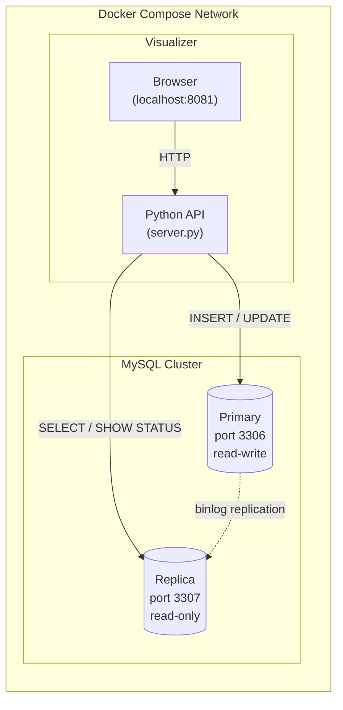

# Lab 10: Database Scalability (Interactive Visualizer)


## Overview

This is the main lab for Module 10. You will use an interactive web
visualizer connected to a live MySQL primary-replica cluster to
explore three database scalability mechanisms: replication, ACID
consistency, and query optimization through indexing. Every button
click executes real SQL against real databases -- the animated
diagrams show actual data flow with measured latency.

The visualizer includes a built-in SQL console where you can run
arbitrary queries against either the primary or replica node and
see the results in real time.

## Learning Objectives

- Understand how primary-replica replication distributes read workloads
- Observe replication lag and understand its impact on data consistency
- Execute ACID transactions and see atomicity in action (commit vs
  rollback)
- Use EXPLAIN to compare query execution plans with and without indexes
- Run SQL directly against primary and replica nodes to verify behavior
- Connect these mechanisms to real-world scaling strategies (read
  replicas, transactional safety, query optimization)

## Prerequisites

- A web browser (Chrome, Firefox, or Safari)
- **Option A (Local):** Docker Desktop installed and running
- **Option B (EC2):** AWS Academy credentials (no local tools required)

## Choose Your Environment

| Environment | What You Need | Setup |
| --- | --- | --- |
| **Option A: Local** | Docker Desktop + browser | `./setup.sh` |
| **Option B: EC2** | Browser only | Upload `cloudformation.yaml` via AWS Console |

Both options run the same MySQL cluster and visualizer. Choose one.

### Option A: Local Setup (Docker Desktop)

```bash
cd 10-databases/visualizer
chmod +x setup.sh cleanup.sh
./setup.sh
```

Open [http://localhost:8081](http://localhost:8081) in your browser.
Then skip to **Task 1** below.

### Option B: EC2 Setup (AWS Academy)

This option runs the visualizer on an EC2 instance -- no local tools
required beyond a web browser.

#### Step 1: Start the Learner Lab

Log in to your AWS Academy Learner Lab course:

1. Go to **Modules** and click **Launch AWS Academy Learner Lab**
1. Click **Start Lab** and wait for the AWS indicator to turn **green**
1. Click the **AWS** link (green dot) to open the AWS Management Console

#### Step 2: Download the CloudFormation template

Download `cloudformation.yaml` from the course repository to your
computer:

```text
https://raw.githubusercontent.com/gamaware/system-design-course/main/10-databases/visualizer/cloudformation.yaml
```

#### Step 3: Create the CloudFormation stack

In the AWS Console:

1. Navigate to **CloudFormation** (search for it in the top bar)
1. Click **Create stack** > **With new resources (standard)**
1. Select **Upload a template file**, click **Choose file**, and
   upload `cloudformation.yaml`
1. Click **Next**
1. Enter the stack name: `lab10-visualizer`
1. Click **Next** twice (skip Configure stack options)
1. On the Review page, scroll down and click **Submit**

#### Step 4: Wait for the stack to complete

The stack takes about 3-5 minutes to create. Watch the progress in
the **Events** tab.

When complete, click the **Outputs** tab to find:

- **PublicIP** -- the EC2 instance address
- **VisualizerURL** -- the URL to open in your browser

#### Step 5: Open the visualizer

Open the **VisualizerURL** from the Outputs tab in your browser:

```text
http://YOUR_PUBLIC_IP:8081
```

The visualizer should load with the three tabs and sidebar showing
database state. If the page does not load, wait another minute for
the setup to finish.

Then continue with **Task 1** below. The visualizer works identically
whether running locally or on EC2.

#### EC2 Cleanup

When done with the lab, delete the CloudFormation stack:

1. Go to **CloudFormation** in the AWS Console
1. Select `lab10-visualizer`
1. Click **Delete** and confirm

This terminates the EC2 instance and removes all resources.

---

## Architecture

The visualizer connects to a live MySQL primary-replica cluster.
All operations are real SQL queries executed against real databases.



## Lab Structure

```text
10-databases/visualizer/
├── LAB-VISUALIZER.md         # This file (lab instructions)
├── docker-compose.yml        # MySQL primary + replica + visualizer
├── setup.sh                  # Start environment and configure replication
├── cleanup.sh                # Tear down all containers and volumes
├── Dockerfile                # Python API bridge image
├── server.py                 # API bridge (proxies SQL to MySQL nodes)
├── index.html                # Interactive visualizer UI
├── app.js                    # Animation engine and interaction logic
└── style.css                 # Dark theme styling
```

---

## Task 1: Explore the Environment

### Step 1.1: Verify the cluster

After running `./setup.sh`, open
[http://localhost:8081](http://localhost:8081). The sidebar on the
right shows live database state:

- **IO Thread / SQL Thread**: Both should show `Yes` (replication
  active)
- **Lag (sec)**: Should be `0` (replica is caught up)
- **Primary Rows / Replica Rows**: Both show `10` (same data)
- **Courses**: 4 courses with enrollment counts

### Step 1.2: Open the SQL Console

At the bottom of the page, click **SQL Console** to expand it.
Select **Primary** and run:

```sql
SHOW TABLES;
```

You should see: `students`, `courses`, `enrollments`, `access_log`.

Now select **Replica** and run the same query. The replica has
identical tables -- it received them through replication.

### Step 1.3: Inspect the schema

In the SQL Console (Primary), run:

```sql
DESCRIBE students;
```

Note the columns: `student_id` (auto-increment PK), `name`, `email`
(unique), `major`, `created_at`. This is a relational schema with
enforced constraints -- the database rejects invalid data at the
storage layer, not just in application code.

> **Question:** What is the difference between enforcing uniqueness in
> the application layer vs the database layer?
>
> **Hint:** Think about what happens when two requests try to insert
> the same email simultaneously. Only the database can guarantee
> atomicity across concurrent connections.

---

## Task 2: Replication -- Scaling Reads

Replication lets you distribute read queries across multiple nodes.
The primary handles all writes; replicas receive changes through the
binary log and can serve read traffic independently.

### Step 2.1: Write to primary, read from replica

In the **Replication** tab:

1. Enter a student name (e.g., `Maria Lopez`) and select a major
1. Click **Write & Read**

Watch the animation:

1. Blue arrow: INSERT goes to the Primary node
1. Purple arrow: SELECT reads from the Replica node
1. Latency pills show real timing for each operation

The result panel shows **REPLICATED** -- the data appeared on the
replica within milliseconds.

### Step 2.2: Verify via SQL Console

Switch to **Replica** in the SQL Console and run:

```sql
SELECT student_id, name, major FROM students ORDER BY student_id DESC LIMIT 3;
```

You should see the student you just created. The replica received the
INSERT through replication without any action from you.

### Step 2.3: Try writing to the replica

In the SQL Console, select **Replica** and run:

```sql
INSERT INTO students (name, email, major) VALUES ('Test', 'test@u.edu', 'X');
```

Expected error: `The MySQL server is running with the
--super-read-only option`. Replicas are read-only by design -- this
prevents split-brain scenarios where two nodes accept conflicting
writes.

### Step 2.4: Check replication status

In the SQL Console (Replica), run:

```sql
SHOW REPLICA STATUS\G
```

Look for `Replica_IO_Running: Yes`, `Replica_SQL_Running: Yes`, and
`Seconds_Behind_Source: 0`.

> **Question:** A social media platform has 100,000 read requests per
> second but only 1,000 writes. How does replication help?
>
> **Hint:** Add read replicas to handle the 100:1 read-to-write ratio.
> Each replica independently serves reads, so 10 replicas reduce each
> node's load to ~10,000 reads/second. But all writes still go to one
> primary -- replication scales reads, not writes.

---

## Task 3: ACID Transactions -- Consistency Under Concurrency

ACID (Atomicity, Consistency, Isolation, Durability) guarantees that
database transactions are reliable. The key property here is
**atomicity**: a transaction either fully succeeds or fully rolls
back. No partial state exists.

### Step 3.1: Successful transfer

Switch to the **Consistency (ACID)** tab.

The controls show a student enrollment transfer: move Student 1 from
CS101 to PHYS101.

1. Set Student ID to `1`, From Course to `CS101`, To Course to `PHYS101`
1. Click **Transfer Enrollment**

Watch the animation step through:

1. `BEGIN` -- start the transaction
1. `DELETE enrollment (CS101)` -- remove the old enrollment
1. `UPDATE CS101 enrolled-1` -- decrement the count
1. `INSERT enrollment (PHYS101)` -- add the new enrollment
1. `UPDATE PHYS101 enrolled+1` -- increment the count
1. `COMMIT` -- make all changes permanent

The result shows **COMMITTED**. Check the sidebar: CS101 dropped from
4 to 3, PHYS101 went from 2 to 3.

### Step 3.2: Trigger a rollback

Now try to transfer Student 1 to PHYS101 again (they are already
enrolled there):

1. Same settings: Student ID `1`, From `CS101`, To `PHYS101`
1. Click **Transfer Enrollment**

The INSERT fails with **CONSTRAINT VIOLATION** (duplicate enrollment).
The result shows **ROLLED BACK** -- the DELETE and UPDATE that happened
before the failed INSERT were also undone. The counts in the sidebar
remain unchanged.

### Step 3.3: Verify atomicity via SQL Console

In the SQL Console (Primary), run:

```sql
SELECT c.code, c.enrolled FROM courses ORDER BY code;
```

Confirm the counts match what the sidebar shows. The failed
transaction left zero trace in the database.

> **Question:** A banking system transfers $100 from Account A to
> Account B. The debit from A succeeds, but the credit to B fails
> (network error). What happens without ACID?
>
> **Hint:** Without atomicity, the $100 disappears -- debited from A
> but never credited to B. With ACID, the entire transaction rolls
> back, and Account A keeps its money. This is why financial systems
> require ACID compliance.

---

## Task 4: Schema Design -- Indexing for Performance

As tables grow, query performance depends on whether the database can
find rows efficiently. Without an index, MySQL must scan every row
(full table scan). With the right index, it jumps directly to
matching rows.

### Step 4.1: EXPLAIN without an index

Switch to the **Schema & Indexing** tab.

The controls show a query: find access log entries for Student 3
accessing resource-10.

1. Set Student ID to `3`, Resource to `resource-10`
1. Click **Run EXPLAIN**

The result shows **Rows scanned: ~9,894** in red, with Key: **NONE
(full scan)**. MySQL examined nearly all 10,000 rows to find a
handful of matches. Check the sidebar: Indexes shows **None**.

### Step 4.2: Add a composite index

Click **Add Index**. This creates a composite index on
`(student_id, resource)`.

Check the sidebar: Indexes now shows **idx_student_resource**.

### Step 4.3: EXPLAIN with the index

Click **Run EXPLAIN** again (same query).

The result now shows **Rows scanned: ~24** in green, with Key:
**idx_student_resource**. MySQL used the index to jump directly to
matching rows -- a ~400x improvement.

### Step 4.4: Verify via SQL Console

In the SQL Console (Primary), compare:

```sql
EXPLAIN SELECT * FROM access_log WHERE student_id = 3 AND resource = 'resource-10';
```

Look at the `type` column: `ref` (index lookup) instead of `ALL`
(full scan). The `rows` column confirms the improvement.

### Step 4.5: Understand the trade-off

Drop the index: click **Drop Index**.

Now run an INSERT in the SQL Console (Primary):

```sql
INSERT INTO access_log (student_id, resource)
VALUES (1, 'resource-99');
```

Note the latency. Now add the index back (click **Add Index**) and
run the same INSERT again. With the index, writes take slightly
longer because MySQL must update both the table and the index.

> **Question:** An e-commerce site has a `products` table with 10
> million rows. Searches by `category` are slow. Should you add an
> index on `category`?
>
> **Hint:** If the table has 50 categories with roughly equal
> distribution, an index on `category` returns ~200,000 rows per
> lookup. The index helps, but a composite index like
> `(category, price)` would be far more selective if queries also
> filter by price range.

---

## Task 5: Free Exploration

Use the SQL Console to explore on your own. Here are some queries to
try:

**Check which students are enrolled in which courses:**

```sql
SELECT s.name, c.code, c.title
FROM enrollments e
JOIN students s ON e.student_id = s.student_id
JOIN courses c ON e.course_id = c.course_id
ORDER BY s.name;
```

**Compare primary vs replica data:**

Run the same SELECT on both Primary and Replica to verify they
return identical results.

**Test isolation by running concurrent queries:**

In one SQL Console query, insert a student. In the sidebar, watch
the Primary Rows counter increment and -- a moment later -- the
Replica Rows counter catch up.

**Reset the database:**

Click the **Reset DB** button in the top-right corner to restore
the original data (10 students, 4 courses, 10 enrollments, no
custom indexes).

---

## Cleanup

```bash
./cleanup.sh
```

## Troubleshooting

| Issue | Cause | Fix |
| --- | --- | --- |
| Port 8081 in use | Another service running | Change port in docker-compose.yml |
| SQL Console shows error | Blocked SQL command | Some DDL commands are blocked for safety |
| Replica shows `--` in sidebar | Replication not configured | Re-run `./setup.sh` |
| EXPLAIN shows `rows: 1` | Table stats stale | Run `ANALYZE TABLE access_log;` in the console |
| Animation stuck | Previous operation still running | Wait for it to finish or refresh the page |

## Key Concepts

| Concept | Description |
| --- | --- |
| **Replication** | Copying data from a primary to one or more replicas via binary log |
| **Read replica** | A read-only copy that offloads SELECT queries from the primary |
| **Replication lag** | Delay between a write on primary and its appearance on replica |
| **ACID** | Atomicity, Consistency, Isolation, Durability -- transaction guarantees |
| **Atomicity** | A transaction either fully succeeds (COMMIT) or fully fails (ROLLBACK) |
| **Full table scan** | MySQL reads every row to find matches -- slow on large tables |
| **Composite index** | An index on multiple columns that speeds up multi-column WHERE clauses |
| **EXPLAIN** | Shows MySQL's query execution plan: index used, rows examined |
| **Read-write split** | Send writes to primary, reads to replicas -- the most common scaling pattern |

## Conclusions

1. **Replication scales reads, not writes.** Adding replicas
   distributes SELECT queries across multiple nodes, but all writes
   still go to one primary. This is the most common first step in
   scaling a relational database.

2. **ACID prevents data corruption under concurrency.** The
   enrollment transfer either fully succeeds or fully rolls back.
   Without atomicity, partial failures leave the database in an
   inconsistent state -- money disappears, inventory goes negative,
   seats are double-booked.

3. **Indexes are the highest-impact optimization for query
   performance.** A single composite index turned a 10,000-row scan
   into a 24-row lookup -- a 400x improvement. But indexes are not
   free: they consume storage and slow down writes. The right index
   depends on your query patterns.

4. **These three mechanisms compose.** A production system uses all
   three: replication for read scaling, ACID for correctness, and
   indexes for performance. They are not alternatives -- they solve
   different problems at different layers.

## Next Steps (Optional)

For deeper hands-on work with other database paradigms, try the
optional labs:

- [Lab 10A -- MySQL CLI](../mysql/LAB-MYSQL.md) -- same mechanisms
  via the command line
- [Lab 10B -- MongoDB](../mongodb/LAB-MONGODB.md) -- replica sets,
  tunable consistency, denormalized schema
- [Lab 10C -- Cassandra](../cassandra/LAB-CASSANDRA.md) -- multi-node
  ring, consistency levels, partition key design
