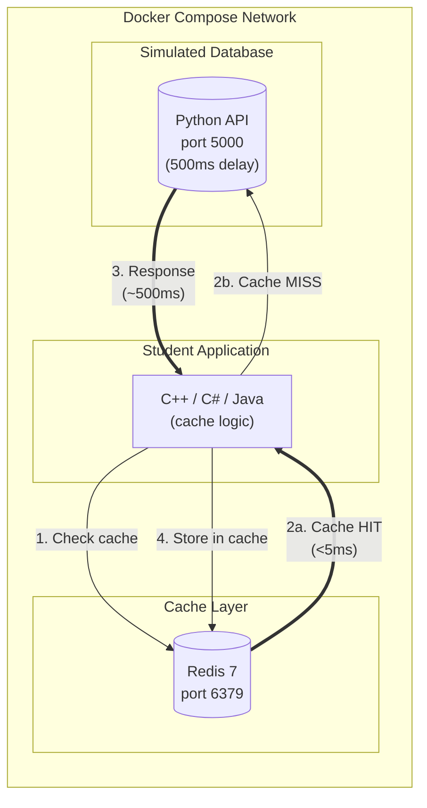
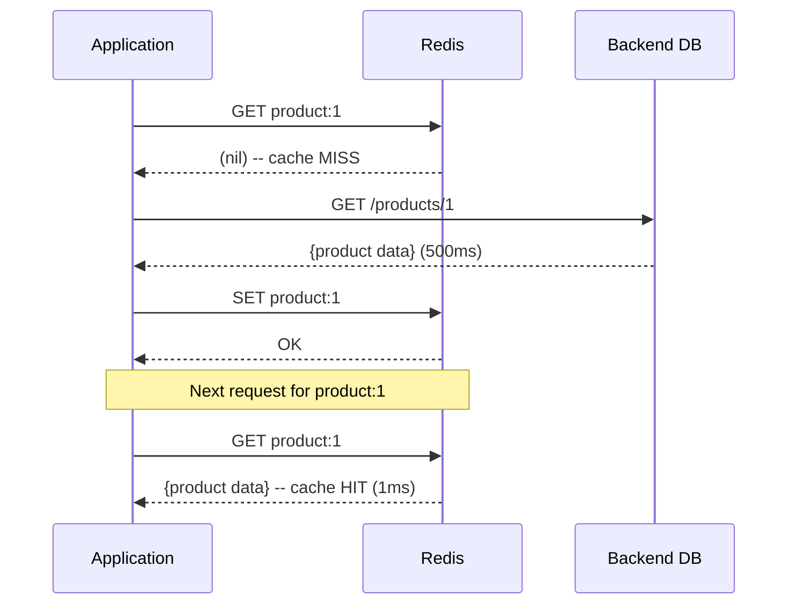
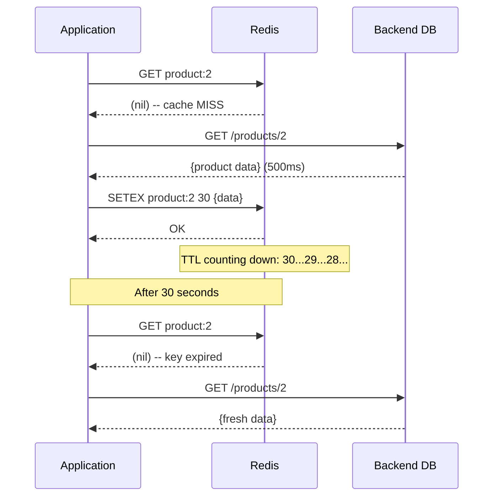
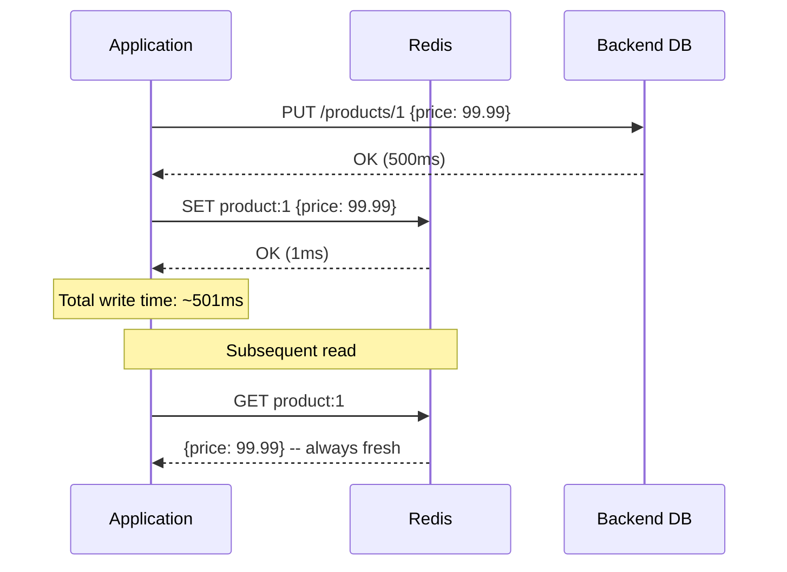
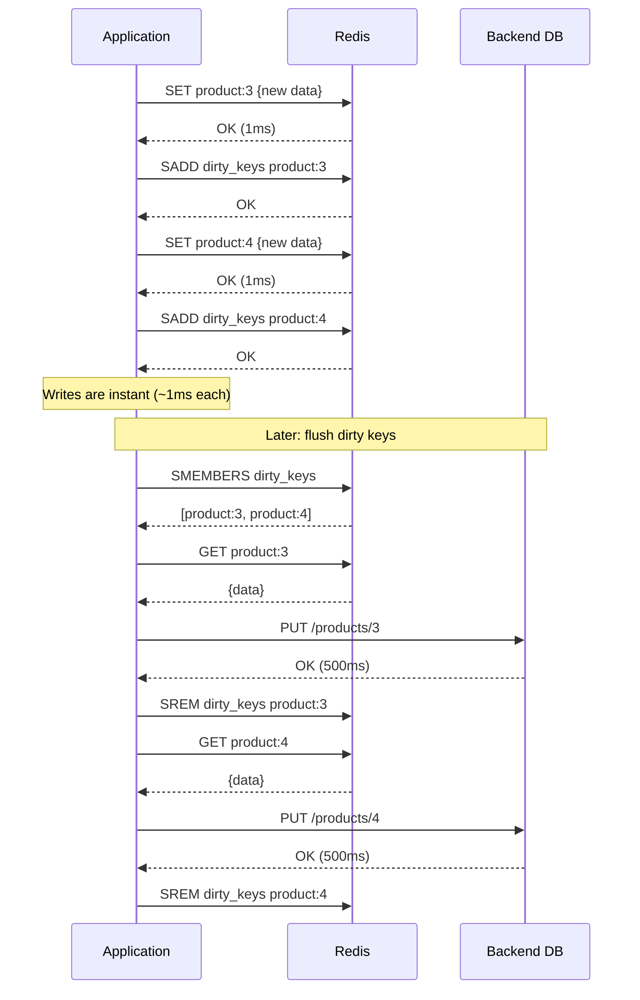

# Caching: Patterns and Eviction with Redis


## Overview

This hands-on lab teaches caching as a system design pattern using Redis.
Students implement four caching strategies (cache-aside, read-through,
write-through, write-back) in their choice of C++, C#, or Java, then
configure and observe Redis eviction policies (LRU, LFU, TTL) under
memory pressure. A simulated slow backend (500ms per request) makes the
performance impact of caching immediately measurable.

## Choose Your Operating System

Select the lab instructions for your operating system:

| Operating System | Lab Instructions | Terminal |
| --- | --- | --- |
| macOS / Linux | [LAB-MACOS.md](LAB-MACOS.md) | Terminal (bash/zsh) |
| Windows | [LAB-WINDOWS.md](LAB-WINDOWS.md) | PowerShell |

Both versions cover the same 7 tasks with identical learning outcomes. The
only differences are installation steps and shell syntax. All Docker and
Redis commands are the same regardless of your local operating system.

## Choose Your Language

Select one language for the lab exercises. All three implement the same
caching patterns with the same learning outcomes:

| Language | Directory | Redis Client Library | Build Tool |
| --- | --- | --- | --- |
| C++ | `cpp/` | hiredis | CMake |
| C# | `csharp/` | StackExchange.Redis | .NET 8 |
| Java | `java/` | Jedis | Maven |

## Learning Objectives

- Implement cache-aside (lazy loading) to reduce backend load
- Build a reusable read-through cache helper with TTL expiration
- Implement write-through to keep cache and backend synchronized
- Implement write-back (write-behind) for high-throughput writes
- Configure Redis eviction policies (LRU, LFU, volatile-TTL) and
  observe their behavior under memory pressure
- Measure and compare cache hit vs miss performance quantitatively
- Understand cache invalidation challenges and trade-offs in
  distributed systems

## Prerequisites

- **Docker Desktop** installed and running (includes Docker Compose)
- Basic familiarity with one of: C++, C#, or Java
- No cloud account required -- everything runs locally via Docker

## Architecture

The lab environment runs entirely in Docker Compose. Redis serves as the
cache layer, a Python HTTP app simulates a slow database backend, and the
student application implements caching patterns in their chosen language.



**Data flow (cache-aside pattern):**

1. Application checks Redis for the requested key
2. **Cache HIT**: Redis returns the value in under 5ms
3. **Cache MISS**: Application fetches from the backend (500ms delay)
4. Application stores the response in Redis for future requests

## Lab Structure

```text
11-caching/
├── README.md                          # This file (lab overview)
├── LAB-MACOS.md                       # Lab instructions (macOS/Linux)
├── LAB-WINDOWS.md                     # Lab instructions (Windows/PowerShell)
├── docker-compose.yml                 # Redis + backend + language profiles
├── setup.sh                           # Start environment (bash)
├── setup.ps1                          # Start environment (PowerShell)
├── cleanup.sh                         # Tear down environment (bash)
├── cleanup.ps1                        # Tear down environment (PowerShell)
├── backend/
│   ├── Dockerfile                     # Python HTTP simulated database
│   └── app.py                         # /products/{id} endpoint (500ms delay)
├── cpp/
│   ├── CMakeLists.txt                 # Build config (hiredis + libcurl)
│   ├── Dockerfile                     # GCC 14 build environment
│   └── cache_lab.cpp                  # Caching exercises (C++)
├── csharp/
│   ├── CacheLab.csproj               # .NET 8 project
│   ├── Dockerfile                     # .NET SDK build environment
│   └── CacheLab.cs                    # Caching exercises (C#)
├── java/
│   ├── pom.xml                        # Maven project (Jedis)
│   ├── Dockerfile                     # JDK 21 build environment
│   └── src/main/java/com/lab/
│       └── CacheLab.java             # Caching exercises (Java)
└── scripts/
    └── seed-database.sh               # Verify backend data
```

## Quick Start

macOS / Linux:

```bash
./setup.sh
```

Windows (PowerShell):

```powershell
.\setup.ps1
```

The setup script starts Redis and the backend, verifies both are healthy,
then prints instructions for choosing a language. Follow the OS-specific
lab instructions for the full 7-task walkthrough.

## Tasks Overview

The lab consists of 7 tasks that build on each other:

| Task | Pattern | What You Do |
| --- | --- | --- |
| 1. Verify Prerequisites | -- | Install Docker, start environment, verify Redis + backend |
| 2. Cache-Aside | Lazy loading | Check cache first, fetch on miss, store for next time |
| 3. Read-Through with TTL | TTL expiration | Reusable cache helper with automatic expiry |
| 4. Write-Through | Synchronous write | Write to backend AND cache on every update |
| 5. Write-Back | Asynchronous write | Write to cache only, flush to backend later |
| 6. Eviction Policies | LRU / LFU / TTL | Fill cache past memory limit, observe eviction |
| 7. Performance Comparison | Benchmarking | Measure all patterns, compare trade-offs, cleanup |

## Cleanup

macOS / Linux:

```bash
./cleanup.sh
```

Windows (PowerShell):

```powershell
.\cleanup.ps1
```

The cleanup script stops all containers, removes volumes, and deletes
locally built Docker images.

## Troubleshooting

| Issue | Cause | Fix |
| --- | --- | --- |
| `docker: command not found` | Docker not installed | Install Docker Desktop |
| `Cannot connect to the Docker daemon` | Docker Desktop not running | Start Docker Desktop |
| `port 6379 already in use` | Another Redis instance running | Stop the other instance or change the port in docker-compose.yml |
| `port 5050 already in use` | Another service on port 5050 | Stop the conflicting service or change the port in docker-compose.yml |
| Backend returns 500ms for every request | This is intentional | The 500ms delay simulates a slow database |
| Redis `READONLY` error | Connected to a replica | Ensure you connect to the primary (default setup has one instance) |
| C++ build fails with missing headers | Dockerfile dependencies | Rebuild with `docker compose --profile cpp build --no-cache` |
| C# restore fails | NuGet connectivity | Check internet connection, rebuild the container |
| Java `mvn` fails | Maven dependency download | Check internet connection, rebuild the container |
| `CONFIG SET` returns error | Redis `maxmemory` syntax | Use bytes: `CONFIG SET maxmemory 1048576` or shorthand `1mb` |
| Eviction not happening | `maxmemory-policy noeviction` | Run `CONFIG SET maxmemory-policy allkeys-lru` first |

## Key Concepts

| Concept | Description |
| --- | --- |
| **Cache Hit** | The requested data is found in the cache -- fast response |
| **Cache Miss** | The data is not in cache -- must fetch from the origin (slow) |
| **Cache-Aside** | Application manages the cache: check, fetch on miss, store |
| **Read-Through** | Cache itself fetches from origin on a miss (abstracted from app) |
| **Write-Through** | Every write goes to both cache and origin synchronously |
| **Write-Back** | Writes go to cache first, flushed to origin asynchronously |
| **TTL** | Time-To-Live: cached entries expire after a set duration |
| **LRU** | Least Recently Used: evicts keys not accessed recently |
| **LFU** | Least Frequently Used: evicts keys accessed fewest times |
| **Eviction** | Removing cached entries when memory limit is reached |
| **Cache Invalidation** | Removing or updating stale cache entries |
| **Cache Stampede** | Many concurrent cache misses for the same key |
| **Cold Start** | Empty cache after restart -- all requests are misses |

### Caching Strategy Diagrams

#### Cache-Aside (Lazy Loading)

The application manages the cache directly. On a miss, it fetches from the
backend and stores the result for future requests.



#### Read-Through with TTL

Same as cache-aside but wrapped in a reusable helper with automatic
expiration. The key expires after the TTL, forcing a fresh fetch.



#### Write-Through

Every write goes to both the backend and the cache synchronously.
The cache is always up-to-date but writes are slower.



#### Write-Back (Write-Behind)

Writes go to the cache only. A separate flush process pushes dirty
entries to the backend later. Fastest writes but risks data loss.



### Caching Pattern Decision Guide

```text
                    ┌─────────────────────┐
                    │ Are reads or writes  │
                    │    more frequent?    │
                    └──────────┬──────────┘
                   ┌───────────┴───────────┐
                   ▼                       ▼
              Read-Heavy              Write-Heavy
                   │                       │
           ┌───────┴───────┐       ┌───────┴───────┐
           │ Need simplest │       │ Can tolerate   │
           │ implementation?│      │ data loss?     │
           └───┬───────┬───┘       └───┬───────┬───┘
               ▼       ▼               ▼       ▼
             Yes      No             Yes      No
               │       │               │       │
               ▼       ▼               ▼       ▼
          Cache-Aside  Read-Through  Write-Back  Write-Through
```

## How This Relates to Scalable Systems Design

**Caching is the most impactful performance optimization in distributed
systems.** A single Redis instance can handle 100,000+ operations per second.
When your backend database handles 1,000 queries per second, adding a cache
layer with a 90% hit rate reduces database load to 100 queries per second --
a 10x improvement without scaling the database.

**Cache-aside is the default pattern for most web applications.** Services
like Netflix, Twitter, and GitHub use cache-aside with Redis or Memcached in
front of their databases. It is simple, the application controls exactly what
gets cached, and a cache failure does not bring down the system -- requests
just go directly to the database (slower but functional).

**Write patterns determine your consistency guarantees.** Write-through
ensures the cache always reflects the database but adds latency to every
write. Write-back gives you sub-millisecond writes but risks losing data if
the cache crashes before flushing. The choice between these patterns depends
on whether your system prioritizes consistency (banking, inventory) or
throughput (analytics, counters, session data).

**Eviction policies prevent unbounded memory growth.** Without eviction, your
cache grows until it runs out of memory and crashes. LRU is the safe default
for most workloads. LFU is better when a small set of items is accessed far
more frequently than others (e.g., a popular product page). Understanding
eviction is essential when sizing cache infrastructure -- a cache that is too
small evicts frequently and provides little benefit.

**Cache invalidation is one of the hardest problems in computer science.**
Phil Karlton famously said there are only two hard things: cache invalidation
and naming things. In a distributed system with multiple services writing to
the same database, keeping all caches consistent is genuinely difficult. TTL
is the simplest solution -- accept that data may be stale for a bounded
duration. For stronger consistency, you need event-driven invalidation
(database change notifications) or distributed cache protocols.

**Connection to earlier labs:** The load balancing concepts from Lab 03
become more effective when combined with caching -- a load balancer
distributes requests across servers, and each server's local cache reduces
backend calls. The security patterns from Lab 06 apply to cache
infrastructure -- Redis should run in a private network (Lab 08 VPC
concepts), and cached data may contain sensitive information that needs
encryption at rest.

## Conclusions

After completing this lab, you should take away these lessons:

1. **Caching transforms application performance.** A 500ms database query
   becomes a sub-5ms cache hit. At scale, this is the difference between
   needing 100 database servers and needing 10. Caching is often the
   highest-impact optimization you can make.

2. **Different caching patterns solve different problems.** Cache-aside is
   the simplest and most common. Write-through guarantees consistency at
   the cost of write latency. Write-back maximizes write throughput at the
   risk of data loss. Choosing the right pattern depends on your
   consistency requirements and failure tolerance.

3. **TTL is the pragmatic answer to cache invalidation.** Perfect cache
   invalidation in a distributed system is extremely difficult. Setting a
   TTL accepts bounded staleness in exchange for simplicity. Most
   production systems use TTL-based expiration with event-driven
   invalidation for critical data.

4. **Eviction policies are not one-size-fits-all.** LRU works well for
   general workloads where recent data is likely to be accessed again. LFU
   is better for skewed access patterns where popularity matters more than
   recency. The wrong eviction policy can make your cache less effective
   than no cache at all.

5. **A cache failure should degrade performance, not break your system.**
   In cache-aside, if Redis goes down, the application falls back to the
   database -- slower but functional. This resilience is why cache-aside is
   the dominant pattern. Systems that depend on the cache being available
   have a single point of failure.

## Next Steps

- [Module 12 -- Proxies](../12-proxies/) -- explore how reverse proxies
  complement caching at the infrastructure level
- [Redis Documentation](https://redis.io/docs/) -- deep dive into Redis
  data structures, persistence, and clustering
- [AWS ElastiCache](https://docs.aws.amazon.com/elasticache/) -- managed
  Redis in the cloud with replication and failover
